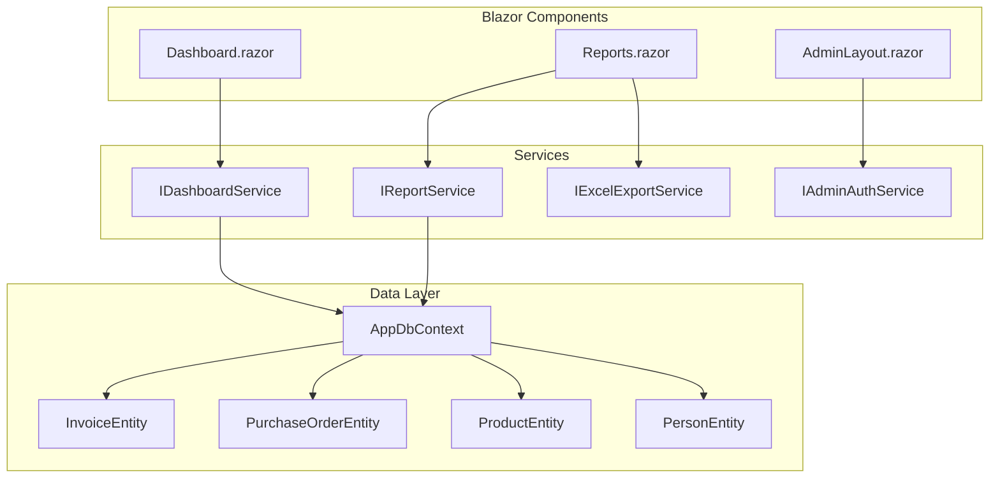

# Design Document: Dashboard & Reports Enhancement

## Overview

Tài liệu này mô tả thiết kế chi tiết cho việc nâng cấp Dashboard và thêm trang Báo cáo mới cho PhoneStoreUser Admin. Hệ thống sẽ cung cấp:
- Dashboard với thống kê doanh số theo tháng, bộ chọn tháng
- Top 10 sản phẩm bán chạy và top 10 khách hàng
- Trang Báo cáo mới với 2 tab: Báo cáo nhập và Báo cáo hóa đơn
- Biểu đồ trực quan và xuất Excel
- Nút logout cho admin

## Architecture



## Components and Interfaces

### 1. Dashboard Component (Updated)

**File:** `PhoneStoreUser/Components/Pages/Admin/Dashboard.razor`

Cập nhật Dashboard hiện tại để thêm:
- Month picker để chọn tháng/năm
- Thống kê doanh số theo tháng đã chọn
- Bảng Top 10 sản phẩm bán chạy
- Bảng Top 10 khách hàng mua nhiều

### 2. Reports Component (New)

**File:** `PhoneStoreUser/Components/Pages/Admin/Reports.razor`

Trang báo cáo mới với:
- Tab navigation (Báo cáo nhập / Báo cáo hóa đơn)
- Date range picker
- Summary cards (tổng số đơn, tổng giá trị)
- Chart component (bar/line chart)
- Data table với pagination
- Export Excel button

### 3. AdminLayout Component (Updated)

**File:** `PhoneStoreUser/Components/Layout/AdminLayout.razor`

Cập nhật để thêm:
- Menu item "Báo cáo" trong sidebar
- Logout button trong header

### 4. Service Interfaces

```csharp
// IDashboardService.cs
public interface IDashboardService
{
    Task<MonthlyStatistics> GetMonthlyStatisticsAsync(int year, int month);
    Task<List<TopProductDto>> GetTopSellingProductsAsync(int year, int month, int count = 10);
    Task<List<TopCustomerDto>> GetTopCustomersAsync(int year, int month, int count = 10);
}

// IReportService.cs
public interface IReportService
{
    Task<PurchaseOrderReportData> GetPurchaseOrderReportAsync(DateTime startDate, DateTime endDate);
    Task<InvoiceReportData> GetInvoiceReportAsync(DateTime startDate, DateTime endDate);
}

// IExcelExportService.cs
public interface IExcelExportService
{
    byte[] ExportPurchaseOrderReport(List<PurchaseOrderReportItem> data, DateTime startDate, DateTime endDate);
    byte[] ExportInvoiceReport(List<InvoiceReportItem> data, DateTime startDate, DateTime endDate);
}

// IAdminAuthService.cs (existing, add method)
public interface IAdminAuthService
{
    Task LogoutAsync();
    // ... existing methods
}
```

## Data Models

### DTOs for Dashboard

```csharp
public class MonthlyStatistics
{
    public decimal TotalRevenue { get; set; }
    public int TotalOrders { get; set; }
    public int NewCustomers { get; set; }
    public decimal RevenueGrowthPercent { get; set; }
    public int OrderGrowthPercent { get; set; }
}

public class TopProductDto
{
    public int ProductId { get; set; }
    public string ProductName { get; set; } = string.Empty;
    public int QuantitySold { get; set; }
    public decimal TotalRevenue { get; set; }
}

public class TopCustomerDto
{
    public int CustomerId { get; set; }
    public string CustomerName { get; set; } = string.Empty;
    public int OrderCount { get; set; }
    public decimal TotalPurchaseValue { get; set; }
}
```

### DTOs for Reports

```csharp
public class PurchaseOrderReportData
{
    public int TotalCount { get; set; }
    public decimal TotalValue { get; set; }
    public List<ChartDataPoint> ChartData { get; set; } = new();
    public List<PurchaseOrderReportItem> Items { get; set; } = new();
}

public class PurchaseOrderReportItem
{
    public int Id { get; set; }
    public DateTime OrderDate { get; set; }
    public string SupplierName { get; set; } = string.Empty;
    public int TotalItems { get; set; }
    public decimal TotalValue { get; set; }
    public string Status { get; set; } = string.Empty;
}

public class InvoiceReportData
{
    public int TotalCount { get; set; }
    public decimal TotalRevenue { get; set; }
    public List<ChartDataPoint> ChartData { get; set; } = new();
    public List<InvoiceReportItem> Items { get; set; } = new();
}

public class InvoiceReportItem
{
    public int Id { get; set; }
    public DateTime InvoiceDate { get; set; }
    public string CustomerName { get; set; } = string.Empty;
    public int TotalItems { get; set; }
    public decimal TotalValue { get; set; }
    public string Status { get; set; } = string.Empty;
}

public class ChartDataPoint
{
    public string Label { get; set; } = string.Empty; // Date or period label
    public decimal Value { get; set; }
    public int Count { get; set; }
}
```

## Correctness Properties

*A property is a characteristic or behavior that should hold true across all valid executions of a system-essentially, a formal statement about what the system should do. Properties serve as the bridge between human-readable specifications and machine-verifiable correctness guarantees.*

### Property 1: Month-based data filtering consistency
*For any* selected month and year, the dashboard statistics (revenue, orders, customers) SHALL only include data from invoices where InvoiceDate falls within that month.
**Validates: Requirements 1.2, 2.3, 3.3**

### Property 2: Top products sorting correctness
*For any* dataset of invoice lines, the top 10 products list SHALL be sorted in descending order by quantity sold, and the list SHALL contain at most 10 items.
**Validates: Requirements 2.1**

### Property 3: Top customers sorting correctness
*For any* dataset of invoices, the top 10 customers list SHALL be sorted in descending order by total purchase value, and the list SHALL contain at most 10 items.
**Validates: Requirements 3.1**

### Property 4: Date range filtering for reports
*For any* selected date range, the report data (purchase orders or invoices) SHALL only include records where the order/invoice date falls within the specified range (inclusive).
**Validates: Requirements 5.3, 6.3**

### Property 5: Excel export data completeness
*For any* report data, the exported Excel file SHALL contain all columns visible in the report table and all rows from the filtered dataset.
**Validates: Requirements 7.3**

## Error Handling

| Scenario | Handling Strategy |
|----------|-------------------|
| Database connection failure | Display error message, retry option |
| No data for selected period | Display "Không có dữ liệu" message |
| Excel export failure | Show error toast, log error |
| Invalid date range | Validate on client, show validation message |
| Session expired | Redirect to login page |

## Testing Strategy

### Property-Based Testing

Sử dụng **FsCheck** (hoặc **Hedgehog** cho C#) để thực hiện property-based testing.

**Configuration:** Mỗi property test sẽ chạy tối thiểu 100 iterations.

**Test Annotations:** Mỗi property test PHẢI được đánh dấu với comment theo format:
`// **Feature: dashboard-reports-enhancement, Property {number}: {property_text}**`

#### Property Tests to Implement:

1. **Property 1 Test:** Generate random invoices with various dates, select random month, verify only matching invoices are included in statistics.

2. **Property 2 Test:** Generate random invoice lines with products, verify top 10 list is correctly sorted by quantity and limited to 10 items.

3. **Property 3 Test:** Generate random invoices with customers, verify top 10 list is correctly sorted by purchase value and limited to 10 items.

4. **Property 4 Test:** Generate random purchase orders/invoices with dates, select random date range, verify only matching records are returned.

5. **Property 5 Test:** Generate random report data, export to Excel, verify all columns and rows are present.

### Unit Tests

Unit tests sẽ cover:
- Service method behavior với specific examples
- Edge cases (empty data, single item, boundary dates)
- Excel file generation format
- Logout functionality

### Integration Tests

- Dashboard loads with correct data from database
- Reports page navigation and tab switching
- Excel download functionality
- Logout clears session and redirects
