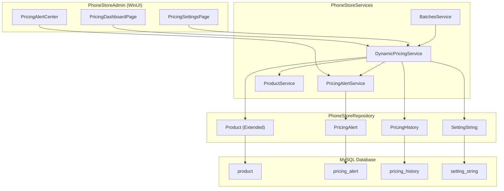
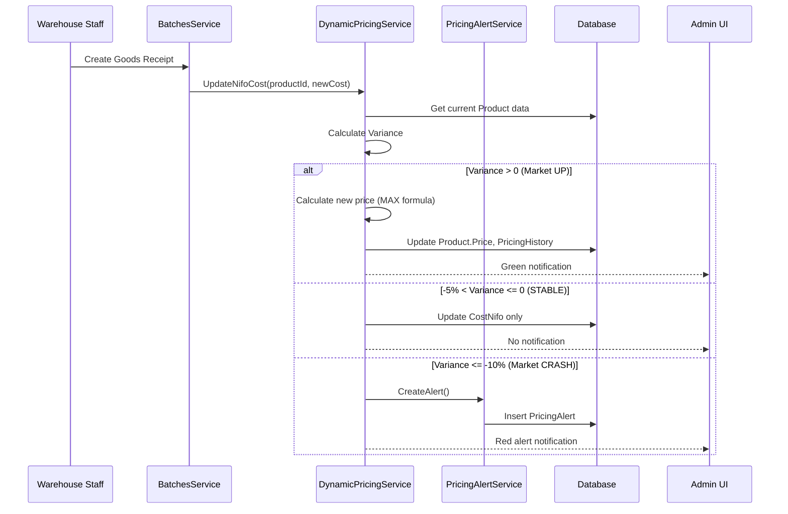

# Design Document: Dynamic Pricing Engine

## Overview

Hệ thống Dynamic Pricing Engine được thiết kế để tự động hóa việc định giá bán sản phẩm dựa trên biến động chi phí thị trường. Hệ thống hoạt động theo mô hình "Dual-Lens" tách biệt dữ liệu kế toán (FIFO) và kinh doanh (NIFO), tích hợp vào kiến trúc hiện có của PhoneStore.

### Key Design Decisions

1. **Mở rộng Product model**: Thêm các trường pricing vào Product thay vì tạo bảng riêng để giữ đơn giản và tối ưu query
2. **Tạo bảng PricingAlert riêng**: Quản lý cảnh báo và quyết định Admin độc lập
3. **Sử dụng SettingString**: Tận dụng cơ chế cấu hình có sẵn cho pricing parameters
4. **Event-driven pricing**: Trigger tính toán giá khi có sự kiện nhập hàng mới

## Architecture



## Components and Interfaces

### 1. Data Layer (PhoneStoreRepository)

#### 1.1 Extended Product Model

Mở rộng `Product.cs` với các trường pricing:

```csharp
// Thêm vào Product.cs
public decimal CostFifo { get; set; }           // Giá vốn FIFO
public decimal CostNifo { get; set; }           // Giá thay thế NIFO
public MarketTrend MarketTrend { get; set; }    // Xu hướng thị trường
public PricingMode PricingMode { get; set; }    // Chế độ định giá
public DateTime? PriceUpdatedAt { get; set; }   // Thời điểm cập nhật giá gần nhất
```

#### 1.2 New Enums

```csharp
// MarketTrend.cs
public enum MarketTrend
{
    STABLE = 0,
    UP = 1,
    DOWN = 2
}

// PricingMode.cs
public enum PricingMode
{
    AUTO_PROTECT = 0,
    CLEARANCE = 1
}

// AlertStatus.cs
public enum AlertStatus
{
    PENDING = 0,
    RESOLVED_HOLD = 1,
    RESOLVED_CLEARANCE = 2
}
```

#### 1.3 PricingAlert Model

```csharp
public class PricingAlert
{
    public int Id { get; set; }
    public int ProductId { get; set; }
    public decimal VariancePercent { get; set; }    // Tỷ lệ chênh lệch (%)
    public decimal CostFifoSnapshot { get; set; }   // FIFO tại thời điểm alert
    public decimal CostNifoSnapshot { get; set; }   // NIFO tại thời điểm alert
    public int CurrentStock { get; set; }           // Tồn kho tại thời điểm alert
    public AlertStatus Status { get; set; }
    public int? ResolvedBy { get; set; }            // Admin ID
    public DateTime? ResolvedAt { get; set; }
    public string? ResolvedNote { get; set; }
    public DateTime CreatedAt { get; set; }
    
    // Navigation
    public Product Product { get; set; }
}
```

#### 1.4 PricingHistory Model

```csharp
public class PricingHistory
{
    public int Id { get; set; }
    public int ProductId { get; set; }
    public decimal OldPrice { get; set; }
    public decimal NewPrice { get; set; }
    public decimal CostFifo { get; set; }
    public decimal CostNifo { get; set; }
    public string ChangeReason { get; set; }        // AUTO_INCREASE, CLEARANCE, MANUAL
    public int? ChangedBy { get; set; }             // null = system auto
    public DateTime CreatedAt { get; set; }
    
    // Navigation
    public Product Product { get; set; }
}
```

#### 1.5 Repository Interfaces

```csharp
// IPricingAlertRepository.cs
public interface IPricingAlertRepository
{
    PricingAlert? GetById(int id);
    IReadOnlyList<PricingAlert> GetPendingAlerts();
    IReadOnlyList<PricingAlert> GetAlertsByProduct(int productId);
    void Insert(PricingAlert alert);
    void Update(PricingAlert alert);
}

// IPricingHistoryRepository.cs
public interface IPricingHistoryRepository
{
    void Insert(PricingHistory history);
    IReadOnlyList<PricingHistory> GetByProduct(int productId, int limit = 50);
    IReadOnlyList<PricingHistory> GetRecent(int limit = 100);
}
```

### 2. Service Layer (PhoneStoreServices)

#### 2.1 IDynamicPricingService Interface

```csharp
public interface IDynamicPricingService
{
    /// <summary>
    /// Cập nhật NIFO cost và trigger pricing workflow
    /// </summary>
    PricingUpdateResult UpdateNifoCost(int productId, decimal newNifoCost);
    
    /// <summary>
    /// Tính toán giá bán theo công thức AUTO_PROTECT
    /// </summary>
    decimal CalculateAutoProtectPrice(decimal costFifo, decimal costNifo);
    
    /// <summary>
    /// Tính toán giá bán theo công thức CLEARANCE
    /// </summary>
    decimal CalculateClearancePrice(decimal costNifo);
    
    /// <summary>
    /// Lấy cấu hình pricing hiện tại
    /// </summary>
    PricingConfiguration GetConfiguration();
    
    /// <summary>
    /// Cập nhật cấu hình pricing
    /// </summary>
    bool UpdateConfiguration(PricingConfiguration config);
    
    /// <summary>
    /// Lấy dữ liệu dashboard pricing
    /// </summary>
    PricingDashboardData GetDashboardData();
    
    /// <summary>
    /// Lấy lịch sử biến động giá của sản phẩm
    /// </summary>
    IReadOnlyList<PricingHistoryViewModel> GetPriceHistory(int productId);
}
```

#### 2.2 IPricingAlertService Interface

```csharp
public interface IPricingAlertService
{
    /// <summary>
    /// Lấy danh sách cảnh báo đang chờ xử lý
    /// </summary>
    IReadOnlyList<PricingAlertViewModel> GetPendingAlerts();
    
    /// <summary>
    /// Xử lý quyết định "Giữ giá"
    /// </summary>
    bool ResolveAsHold(int alertId, int adminId, string? note);
    
    /// <summary>
    /// Xử lý quyết định "Kích hoạt xả hàng"
    /// </summary>
    bool ResolveAsClearance(int alertId, int adminId, string? note);
    
    /// <summary>
    /// Tạo cảnh báo mới
    /// </summary>
    void CreateAlert(int productId, decimal variance, decimal costFifo, decimal costNifo, int stock);
}
```

#### 2.3 ViewModels

```csharp
// PricingUpdateResult.cs
public class PricingUpdateResult
{
    public bool Success { get; set; }
    public string Action { get; set; }          // PRICE_INCREASED, PRICE_HELD, ALERT_CREATED
    public decimal? OldPrice { get; set; }
    public decimal? NewPrice { get; set; }
    public decimal? VariancePercent { get; set; }
    public int? AlertId { get; set; }
    public string? Message { get; set; }
}

// PricingConfiguration.cs
public class PricingConfiguration
{
    public decimal DesiredMargin { get; set; }      // Default: 0.10 (10%)
    public decimal MinimumMargin { get; set; }      // Default: 0.05 (5%)
    public decimal VarianceThreshold { get; set; } // Default: -0.10 (-10%)
    public decimal StableRangeMax { get; set; }    // Default: 0 (0%)
    public decimal StableRangeMin { get; set; }    // Default: -0.05 (-5%)
}

// PricingDashboardData.cs
public class PricingDashboardData
{
    public int TotalProducts { get; set; }
    public int ProductsWithPriceIncrease { get; set; }
    public int ProductsInClearance { get; set; }
    public int PendingAlerts { get; set; }
    public IReadOnlyList<PricingTrendItem> RecentTrends { get; set; }
    public IReadOnlyList<PricingAlertViewModel> TopAlerts { get; set; }
}

// PricingAlertViewModel.cs
public class PricingAlertViewModel
{
    public int AlertId { get; set; }
    public int ProductId { get; set; }
    public string ProductName { get; set; }
    public string ProductSku { get; set; }
    public decimal VariancePercent { get; set; }
    public decimal CostFifo { get; set; }
    public decimal CostNifo { get; set; }
    public int CurrentStock { get; set; }
    public decimal PotentialLoss { get; set; }      // (FIFO - NIFO) * Stock
    public DateTime CreatedAt { get; set; }
}
```

### 3. Presentation Layer (PhoneStoreAdmin)

#### 3.1 PricingDashboardPage

Trang dashboard hiển thị tổng quan biến động giá:

- **Summary Cards**: Tổng sản phẩm, số sản phẩm tăng giá, số sản phẩm xả kho, số cảnh báo pending
- **Price Trend Chart**: Biểu đồ so sánh FIFO vs NIFO theo thời gian (sử dụng LiveCharts2)
- **Recent Activity List**: Danh sách các thay đổi giá gần đây với color coding
- **Quick Actions**: Nút truy cập nhanh đến Alert Center và Settings

#### 3.2 PricingAlertCenterPage

Trang quản lý cảnh báo:

- **Alert List**: DataGrid hiển thị các cảnh báo pending với thông tin chi tiết
- **Alert Detail Panel**: Panel hiển thị chi tiết khi chọn alert
- **Action Buttons**: "Giữ giá" và "Kích hoạt xả hàng" với confirmation dialog
- **Filter/Sort**: Lọc theo mức độ nghiêm trọng, sắp xếp theo ngày/variance

#### 3.3 PricingSettingsPage

Trang cấu hình pricing:

- **Margin Settings**: Input fields cho Desired Margin và Minimum Margin
- **Threshold Settings**: Input field cho Variance Threshold
- **Preview Calculator**: Tool tính toán preview giá với các tham số đã nhập

## Data Models

### Database Schema Changes

```sql
-- Thêm cột vào bảng product
ALTER TABLE product ADD COLUMN cost_fifo DECIMAL(12,2) DEFAULT 0;
ALTER TABLE product ADD COLUMN cost_nifo DECIMAL(12,2) DEFAULT 0;
ALTER TABLE product ADD COLUMN market_trend TINYINT DEFAULT 0;
ALTER TABLE product ADD COLUMN pricing_mode TINYINT DEFAULT 0;
ALTER TABLE product ADD COLUMN price_updated_at DATETIME NULL;

-- Bảng pricing_alert
CREATE TABLE pricing_alert (
    id INT PRIMARY KEY AUTO_INCREMENT,
    product_id INT NOT NULL,
    variance_percent DECIMAL(5,2) NOT NULL,
    cost_fifo_snapshot DECIMAL(12,2) NOT NULL,
    cost_nifo_snapshot DECIMAL(12,2) NOT NULL,
    current_stock INT NOT NULL,
    status TINYINT DEFAULT 0,
    resolved_by INT NULL,
    resolved_at DATETIME NULL,
    resolved_note VARCHAR(500) NULL,
    created_at DATETIME DEFAULT CURRENT_TIMESTAMP,
    FOREIGN KEY (product_id) REFERENCES product(id),
    FOREIGN KEY (resolved_by) REFERENCES account(id)
);

-- Bảng pricing_history
CREATE TABLE pricing_history (
    id INT PRIMARY KEY AUTO_INCREMENT,
    product_id INT NOT NULL,
    old_price DECIMAL(12,2) NOT NULL,
    new_price DECIMAL(12,2) NOT NULL,
    cost_fifo DECIMAL(12,2) NOT NULL,
    cost_nifo DECIMAL(12,2) NOT NULL,
    change_reason VARCHAR(50) NOT NULL,
    changed_by INT NULL,
    created_at DATETIME DEFAULT CURRENT_TIMESTAMP,
    FOREIGN KEY (product_id) REFERENCES product(id),
    FOREIGN KEY (changed_by) REFERENCES account(id)
);

-- Thêm setting codes cho pricing
INSERT INTO setting_string (code, value, type) VALUES 
('PRICING_DESIRED_MARGIN', '0.10', 'decimal'),
('PRICING_MINIMUM_MARGIN', '0.05', 'decimal'),
('PRICING_VARIANCE_THRESHOLD', '-0.10', 'decimal'),
('PRICING_STABLE_RANGE_MAX', '0', 'decimal'),
('PRICING_STABLE_RANGE_MIN', '-0.05', 'decimal');
```

### Data Flow Diagram



## Error Handling

### Service Layer Errors

| Error Code | Description | Handling |
|------------|-------------|----------|
| `PRODUCT_NOT_FOUND` | Product ID không tồn tại | Return error result, log warning |
| `INVALID_COST_VALUE` | Cost value <= 0 | Reject update, return validation error |
| `ALERT_NOT_FOUND` | Alert ID không tồn tại | Return error result |
| `ALERT_ALREADY_RESOLVED` | Alert đã được xử lý | Return error result |
| `CONFIG_UPDATE_FAILED` | Không thể lưu cấu hình | Log error, return failure |

### Validation Rules

```csharp
public class PricingValidation
{
    public static bool ValidateCostValue(decimal cost) => cost > 0;
    public static bool ValidateMargin(decimal margin) => margin >= 0 && margin <= 1;
    public static bool ValidateThreshold(decimal threshold) => threshold >= -1 && threshold <= 0;
}
```

### Logging Strategy

- **INFO**: Successful price updates, configuration changes
- **WARNING**: Alerts created, unusual variance detected
- **ERROR**: Database failures, validation errors

## Testing Strategy

### Unit Tests

1. **DynamicPricingService Tests**
   - `CalculateAutoProtectPrice_WithHigherNifo_ReturnsNifoBasedPrice`
   - `CalculateAutoProtectPrice_WithHigherFifo_ReturnsFifoBasedPrice`
   - `CalculateClearancePrice_ReturnsNifoWithMinMargin`
   - `UpdateNifoCost_MarketUp_AutoIncreasesPrice`
   - `UpdateNifoCost_MarketStable_KeepsCurrentPrice`
   - `UpdateNifoCost_MarketCrash_CreatesAlert`

2. **PricingAlertService Tests**
   - `ResolveAsHold_UpdatesStatusAndKeepsPrice`
   - `ResolveAsClearance_UpdatesStatusAndRecalculatesPrice`
   - `CreateAlert_WithValidData_InsertsAlert`

### Integration Tests

1. **End-to-End Pricing Flow**
   - Goods receipt → NIFO update → Price calculation → History logging
   - Alert creation → Admin resolution → Price update

2. **Configuration Tests**
   - Update configuration → Verify new calculations use updated values

### UI Tests (Manual)

1. Dashboard displays correct summary data
2. Alert center shows pending alerts with correct information
3. Action buttons trigger correct workflows
4. Settings page saves and loads configuration correctly
