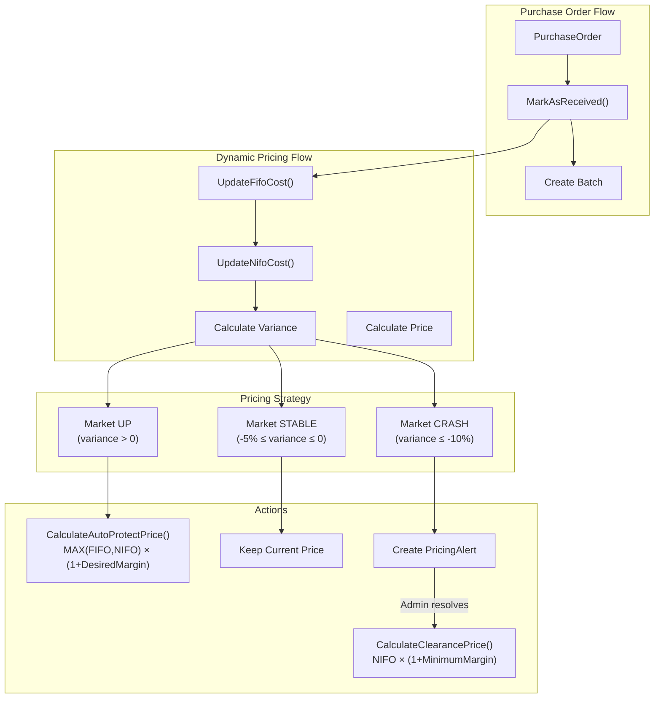

# Design Document: Integrate Dynamic Pricing into PO and Batch Flow

## Overview

Tài liệu này mô tả thiết kế chi tiết để tích hợp Dynamic Pricing Engine vào quy trình Purchase Order (PO) và Batch. Mục tiêu là tự động cập nhật Product.Price khi có hàng nhập mới, sử dụng các service và logic đã có sẵn trong DynamicPricingService.

### Key Design Decisions

1. **Tận dụng DynamicPricingService hiện có**: Sử dụng method `UpdateNifoCost()` đã implement đầy đủ logic pricing
2. **Inject DynamicPricingService vào PurchaseOrderService**: Để trigger pricing update khi MarkAsReceived
3. **Cập nhật CostFifo với weighted average**: Thêm method mới trong DynamicPricingService để tính FIFO
4. **Không thay đổi logic BatchProduct.SellingPrice**: Giữ nguyên cách tính hiện tại (UnitCost × (1 + ProfitMargin))

## Architecture



## Components and Interfaces

### 1. PurchaseOrderService Changes

Inject `IDynamicPricingService` và gọi pricing update trong `MarkAsReceived()`:

```csharp
public class PurchaseOrderService : IPurchaseOrderService
{
    private readonly IDynamicPricingService _dynamicPricingService;
    
    // Constructor thêm dependency
    public PurchaseOrderService(
        // ... existing dependencies
        IDynamicPricingService dynamicPricingService)
    {
        _dynamicPricingService = dynamicPricingService;
    }
    
    public void MarkAsReceived(int id)
    {
        // ... existing batch creation logic
        
        // After batch is created, trigger pricing updates
        foreach (var line in po.PurchaseOrderLines)
        {
            TriggerPricingUpdate(line.ProductId, line.UnitCost, line.Quantity);
        }
    }
    
    private void TriggerPricingUpdate(int productId, decimal unitCost, int quantity)
    {
        try
        {
            // 1. Update FIFO cost with weighted average
            _dynamicPricingService.UpdateFifoCost(productId, unitCost, quantity);
            
            // 2. Update NIFO cost and trigger pricing workflow
            var result = _dynamicPricingService.UpdateNifoCost(productId, unitCost);
            
            Logger.Info($"Pricing update for product {productId}: {result.Action}");
        }
        catch (Exception ex)
        {
            Logger.Error($"Failed to trigger pricing update for product {productId}", ex);
            // Don't fail the entire operation
        }
    }
}
```

### 2. IDynamicPricingService Interface Extension

Thêm method mới để cập nhật CostFifo:

```csharp
public interface IDynamicPricingService
{
    // Existing methods...
    
    /// <summary>
    /// Cập nhật CostFifo sử dụng weighted average calculation
    /// Formula: ((OldFifo × OldStock) + (NewCost × NewQuantity)) / (OldStock + NewQuantity)
    /// </summary>
    /// <param name="productId">ID sản phẩm</param>
    /// <param name="newCost">Giá nhập mới</param>
    /// <param name="quantity">Số lượng nhập</param>
    /// <returns>True nếu cập nhật thành công</returns>
    bool UpdateFifoCost(int productId, decimal newCost, int quantity);
}
```

### 3. DynamicPricingService Implementation

Implement method `UpdateFifoCost()`:

```csharp
public bool UpdateFifoCost(int productId, decimal newCost, int quantity)
{
    try
    {
        var product = _productRepository.GetById(productId);
        if (product == null)
        {
            Logger.Warning($"Product {productId} not found for FIFO update");
            return false;
        }
        
        var oldFifo = product.CostFifo;
        
        // Get current stock
        var stockCounts = _productSerialRepository.GetInStockCountsByProductIds(new[] { productId });
        var currentStock = stockCounts.TryGetValue(productId, out var count) ? count : 0;
        
        decimal newFifo;
        string reason;
        
        if (currentStock == 0 || oldFifo <= 0)
        {
            // First time or no existing stock - set FIFO = new cost
            newFifo = newCost;
            reason = "INITIAL_FIFO";
        }
        else
        {
            // Weighted average: ((OldFifo × OldStock) + (NewCost × NewQuantity)) / (OldStock + NewQuantity)
            newFifo = ((oldFifo * currentStock) + (newCost * quantity)) / (currentStock + quantity);
            newFifo = Math.Round(newFifo, 2, MidpointRounding.AwayFromZero);
            reason = "FIFO_WEIGHTED_AVG";
        }
        
        product.CostFifo = newFifo;
        _productRepository.Update(product);
        
        // Log to pricing history
        LogPriceHistory(productId, product.Price, product.Price, newFifo, product.CostNifo, reason, null);
        
        Logger.Info($"Updated FIFO for product {productId}: {oldFifo} -> {newFifo} (reason: {reason})");
        return true;
    }
    catch (Exception ex)
    {
        Logger.Error($"Failed to update FIFO cost for product {productId}", ex);
        return false;
    }
}
```

### 4. UpdateNifoCost Enhancement

Cập nhật method `UpdateNifoCost()` để xử lý sản phẩm mới:

```csharp
public PricingUpdateResult UpdateNifoCost(int productId, decimal newNifoCost)
{
    // ... existing validation
    
    var product = _productRepository.GetById(productId);
    
    // Handle new product without pricing data
    if (product.CostFifo <= 0)
    {
        product.CostFifo = newNifoCost;
        Logger.Info($"Initialized CostFifo for product {productId}: {newNifoCost}");
    }
    
    // Handle product without price
    if (product.Price <= 0)
    {
        var initialPrice = CalculateAutoProtectPrice(product.CostFifo, newNifoCost);
        product.Price = initialPrice;
        product.PriceUpdatedAt = DateTime.UtcNow;
        LogPriceHistory(productId, 0, initialPrice, product.CostFifo, newNifoCost, "INITIAL_PRICING", null);
        Logger.Info($"Initialized price for product {productId}: {initialPrice}");
    }
    
    // ... existing variance calculation and pricing logic
}
```

## Data Flow

### Sequence Diagram: MarkAsReceived with Dynamic Pricing

```mermaid
sequenceDiagram
    participant Admin
    participant POS as PurchaseOrderService
    participant DPS as DynamicPricingService
    participant PR as ProductRepository
    participant PSR as ProductSerialRepository
    participant PHR as PricingHistoryRepository
    participant PAR as PricingAlertRepository

    Admin->>POS: MarkAsReceived(poId)
    POS->>POS: Create Batch & BatchProducts
    
    loop For each PurchaseOrderLine
        POS->>DPS: UpdateFifoCost(productId, unitCost, quantity)
        DPS->>PR: GetById(productId)
        DPS->>PSR: GetInStockCountsByProductIds([productId])
        DPS->>DPS: Calculate weighted average FIFO
        DPS->>PR: Update(product)
        DPS->>PHR: Insert(history)
        DPS-->>POS: true
        
        POS->>DPS: UpdateNifoCost(productId, unitCost)
        DPS->>PR: GetById(productId)
        DPS->>DPS: Calculate variance
        
        alt variance > 0 (Market UP)
            DPS->>DPS: CalculateAutoProtectPrice()
            DPS->>PR: Update(product with new price)
            DPS->>PHR: Insert(history)
            DPS-->>POS: PRICE_INCREASED
        else -5% ≤ variance ≤ 0 (STABLE)
            DPS->>PR: Update(product)
            DPS-->>POS: PRICE_HELD
        else variance ≤ -10% (CRASH)
            DPS->>PAR: Insert(alert)
            DPS->>PR: Update(product)
            DPS-->>POS: ALERT_CREATED
        end
    end
    
    POS->>POS: Update PO status to RECEIVED
    POS-->>Admin: Success
```

## Data Models

### No Schema Changes Required

Tất cả các model và database schema đã được tạo sẵn trong dynamic-pricing-engine spec:
- Product model đã có: CostFifo, CostNifo, MarketTrend, PricingMode, PriceUpdatedAt
- PricingHistory table đã có
- PricingAlert table đã có

## Error Handling

| Scenario | Handling |
|----------|----------|
| Product not found | Log warning, skip pricing update, continue with other products |
| FIFO calculation fails | Log error, skip FIFO update, continue with NIFO update |
| NIFO update fails | Log error, continue with other products |
| Database error | Log error, don't fail entire MarkAsReceived operation |

## Testing Strategy

### Unit Tests

1. **UpdateFifoCost Tests**
   - `UpdateFifoCost_NewProduct_SetsFifoEqualToNewCost`
   - `UpdateFifoCost_ExistingStock_CalculatesWeightedAverage`
   - `UpdateFifoCost_ProductNotFound_ReturnsFalse`

2. **UpdateNifoCost Enhancement Tests**
   - `UpdateNifoCost_NewProductNoFifo_InitializesFifo`
   - `UpdateNifoCost_NewProductNoPrice_InitializesPrice`

### Integration Tests

1. **MarkAsReceived with Pricing**
   - `MarkAsReceived_TriggersPricingUpdate_ForAllProducts`
   - `MarkAsReceived_PricingFailure_DoesNotFailOperation`

## Implementation Notes

1. **Order of Operations**: Phải gọi `UpdateFifoCost()` trước `UpdateNifoCost()` để đảm bảo FIFO được cập nhật trước khi tính variance
2. **Transaction Handling**: Pricing updates được thực hiện sau khi batch transaction commit để đảm bảo data consistency
3. **Error Isolation**: Pricing errors không được làm fail toàn bộ MarkAsReceived operation
