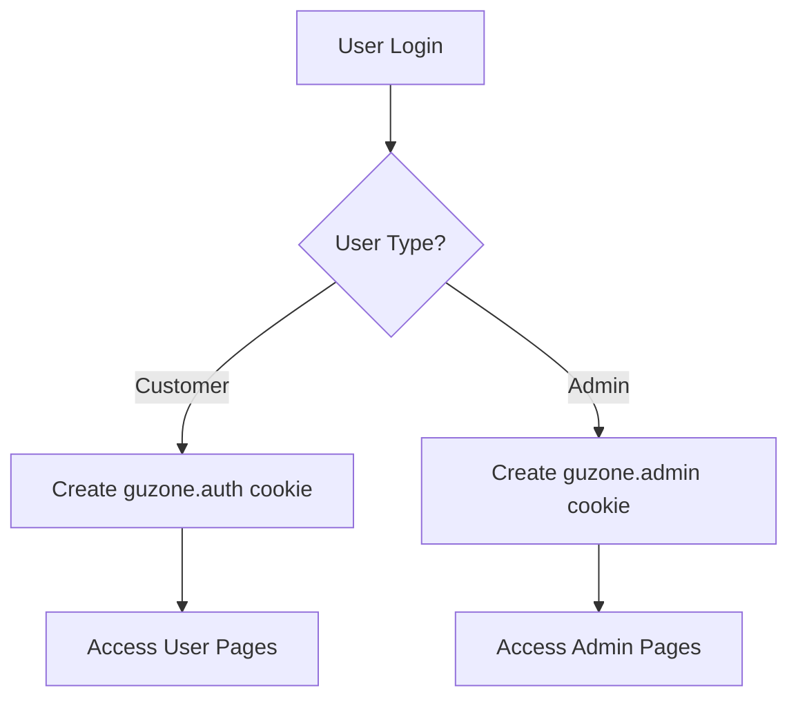
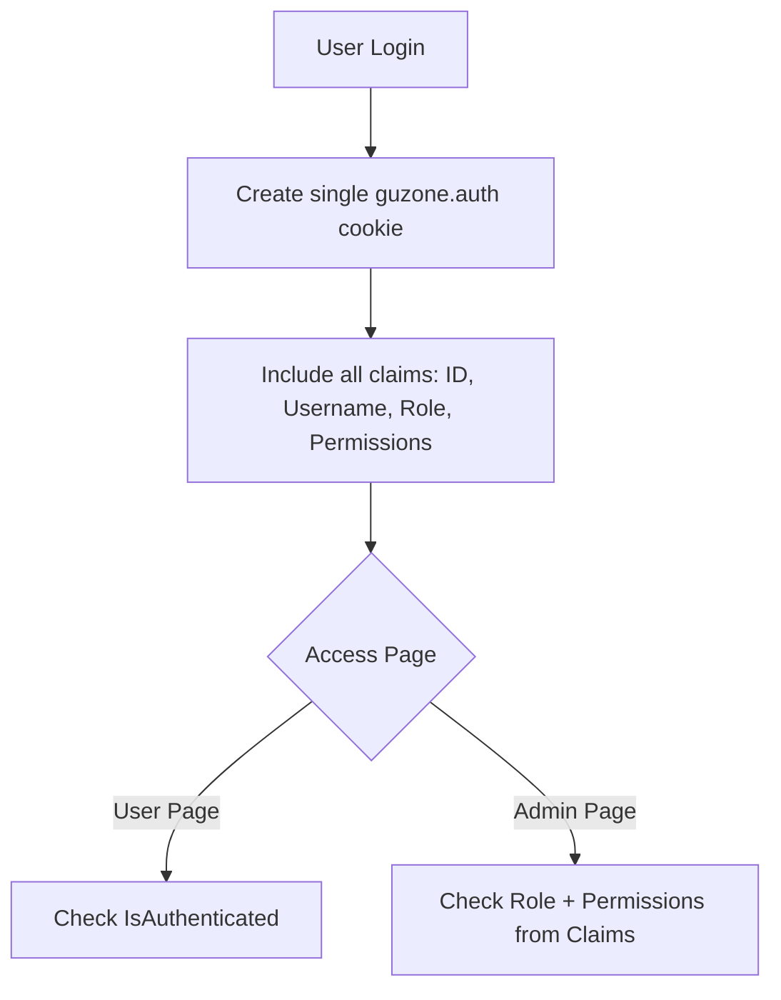

# Design Document: PhoneStoreUser Bug Fixes and Improvements

## Overview

Tài liệu này mô tả thiết kế chi tiết cho việc sửa lỗi và cải tiến ứng dụng PhoneStoreUser. Các thay đổi bao gồm:
- Sửa lỗi đăng ký (hash password và lưu database)
- Đơn giản hóa authentication từ 2 cookie sang 1 cookie với permission check
- Cải thiện UI modal tạo hóa đơn (thêm scroll)
- Thêm thống kê xuất hóa đơn
- Sửa lỗi tìm kiếm và sửa khách hàng
- Loại bỏ action gửi mail
- Sửa lỗi thêm thuộc tính sản phẩm khi tạo mới
- Validate serial khi tạo hóa đơn
- Giới hạn tồn kho khi thêm vào giỏ hàng

## Architecture

### Current Architecture
```
PhoneStoreUser (Blazor Server)
├── Components/Pages/          # Razor pages
├── Components/UI/             # Reusable UI components
├── Services/                  # Business logic services
├── Data/                      # Entity Framework DbContext
└── Utils/                     # Utility classes (PasswordHasher)
```

### Authentication Flow (Current - 2 Cookies)


### Authentication Flow (New - 1 Cookie)


## Components and Interfaces

### 1. Registration Component Changes

**File:** `PhoneStoreUser/Components/Pages/Register.razor.cs`

```csharp
public partial class Register : ComponentBase
{
    [Inject] public IDbContextFactory<AppDbContext> DbContextFactory { get; set; }
    [Inject] public NavigationManager NavigationManager { get; set; }
    
    public RegisterModel Model { get; set; } = new();
    public bool IsLoading { get; set; }
    public bool ShowSuccessMessage { get; set; }
    public string? ErrorMessage { get; set; }

    private async Task HandleValidSubmit()
    {
        // 1. Validate all fields
        // 2. Check for duplicate username/email
        // 3. Hash password using PasswordHasher.HashPassword()
        // 4. Create Person and Account entities
        // 5. Save to database
        // 6. Redirect to login with success message
    }
}
```

### 2. Authentication Service Changes

**File:** `PhoneStoreUser/Program.cs` - Login Endpoint

```csharp
// Single cookie authentication with all claims
app.MapPost("/login", async (LoginModel model, HttpContext context, IDbContextFactory<AppDbContext> dbContextFactory) =>
{
    // 1. Validate credentials
    // 2. Load user with permissions
    // 3. Create claims including permissions
    // 4. Sign in with single cookie scheme
});
```

**New Claims Structure:**
```csharp
var claims = new List<Claim>
{
    new(ClaimTypes.NameIdentifier, account.Id.ToString()),
    new(ClaimTypes.Name, account.Username),
    new(ClaimTypes.Email, person.Email),
    new(ClaimTypes.Role, roleName),
    new("person_id", account.PersonId.ToString()),
    new("permissions", JsonSerializer.Serialize(permissions)) // New: serialized permissions
};
```

### 3. Customer Service Changes

**File:** `PhoneStoreUser/Services/IAdminCustomerService.cs`

```csharp
public interface IAdminCustomerService
{
    Task<PagedResult<AdminCustomerDto>> GetCustomersAsync(int page, int pageSize, string? searchTerm = null);
    Task CreateCustomerAsync(CreateCustomerDto dto);
    Task<AdminCustomerDto?> GetCustomerByIdAsync(int id);
    Task UpdateCustomerAsync(int id, UpdateCustomerDto dto);
}
```

**File:** `PhoneStoreUser/Components/ViewModels/AdminCustomerDto.cs`

```csharp
public class UpdateCustomerDto
{
    public string FullName { get; set; } = string.Empty;
    public string Phone { get; set; } = string.Empty;
    public string Email { get; set; } = string.Empty;
    public string Address { get; set; } = string.Empty;
}
```

### 4. Order Statistics Service

**File:** `PhoneStoreUser/Services/IAdminOrderService.cs`

```csharp
public interface IAdminOrderService
{
    // Existing methods...
    Task<OrderStatisticsDto> GetOrderStatisticsAsync(DateTime? fromDate = null, DateTime? toDate = null);
}
```

**File:** `PhoneStoreUser/Components/ViewModels/OrderStatisticsDto.cs`

```csharp
public class OrderStatisticsDto
{
    public int TotalInvoices { get; set; }
    public decimal TotalRevenue { get; set; }
    public decimal AverageOrderValue { get; set; }
    public int TodayInvoices { get; set; }
    public decimal TodayRevenue { get; set; }
    public int WeekInvoices { get; set; }
    public decimal WeekRevenue { get; set; }
    public int MonthInvoices { get; set; }
    public decimal MonthRevenue { get; set; }
}
```

### 5. Cart Service Changes

**File:** `PhoneStoreUser/Services/ICartService.cs`

```csharp
public interface ICartService
{
    // Existing methods...
    Task<(bool success, string? message)> AddToCartWithInventoryCheck(Product product, int quantity, string? imageUrl = null);
    Task<(bool success, string? message)> UpdateQuantityWithInventoryCheck(Product product, int quantity);
    Task<List<CartValidationResult>> ValidateCartAtCheckout();
}

public class CartValidationResult
{
    public int ProductId { get; set; }
    public string ProductName { get; set; } = string.Empty;
    public int RequestedQuantity { get; set; }
    public int AvailableQuantity { get; set; }
    public bool IsValid { get; set; }
    public string? Message { get; set; }
}
```

### 6. Product Service Changes

**File:** `PhoneStoreUser/Services/IProductService.cs`

```csharp
public interface IProductService
{
    // Existing methods...
    Task<int> CreateProductWithAttributesAsync(ProductEntity product, List<ProductAttributeValueEntity> attributeValues);
}
```

## Data Models

### Existing Models (No Changes)
- `AccountEntity` - User account with hashed password
- `PersonEntity` - Person information
- `CustomerEntity` - Customer-specific data
- `ProductEntity` - Product information
- `ProductAttributeValueEntity` - Product attribute values
- `InvoiceEntity` - Invoice/Order data
- `ProductSerialEntity` - Serial number tracking

### DTO Changes

**CreateCustomerDto** - Remove SendWelcomeEmail field:
```csharp
public class CreateCustomerDto
{
    public string FullName { get; set; } = string.Empty;
    public string Phone { get; set; } = string.Empty;
    public string Email { get; set; } = string.Empty;
    public string Address { get; set; } = string.Empty;
    // Removed: public bool SendWelcomeEmail { get; set; }
}
```

## Correctness Properties

*A property is a characteristic or behavior that should hold true across all valid executions of a system-essentially, a formal statement about what the system should do. Properties serve as the bridge between human-readable specifications and machine-verifiable correctness guarantees.*

### Property 1: Password Hash Consistency
*For any* valid password string, hashing it with SHA256 and then verifying the same password against the hash SHALL return true.
**Validates: Requirements 1.1**

### Property 2: Registration Duplicate Prevention
*For any* existing account with username U or email E, attempting to register a new account with the same username U or email E SHALL be rejected.
**Validates: Requirements 1.4**

### Property 3: Single Cookie Authentication
*For any* successful login, exactly one authentication cookie SHALL be created containing all required claims (user ID, username, role, permissions).
**Validates: Requirements 2.1**

### Property 4: Permission-Based Authorization
*For any* authenticated user accessing a protected resource, the system SHALL grant or deny access based solely on the permissions contained in the authentication cookie claims.
**Validates: Requirements 2.2**

### Property 5: Order Statistics Accuracy
*For any* set of orders in a date range, the calculated statistics (total count, total revenue, average value) SHALL equal the sum/count/average of the individual order values in that range.
**Validates: Requirements 4.1, 4.2**

### Property 6: Customer Search Completeness
*For any* search term T, all customers whose name, phone, or email contains T SHALL appear in the search results, and no customers without T in any of these fields SHALL appear.
**Validates: Requirements 5.1**

### Property 7: Customer Update Persistence
*For any* customer update with valid data, reading the customer record after update SHALL return the updated values.
**Validates: Requirements 5.3**

### Property 8: Product Attribute Persistence
*For any* new product with attribute values, saving the product and then loading it SHALL return all the same attribute values.
**Validates: Requirements 7.2, 7.3**

### Property 9: Serial Validation for Order Processing
*For any* serial number entered in the order processing page, the system SHALL validate that the serial exists, belongs to the correct product, and has 'in_stock' status before accepting it.
**Validates: Requirements 8.1, 8.2, 8.3**

### Property 10: Cart Inventory Limit
*For any* product with available quantity Q, the cart quantity for that product SHALL never exceed Q.
**Validates: Requirements 9.1, 9.2, 9.3**

### Property 11: Checkout Inventory Validation
*For any* cart at checkout, if any product's cart quantity exceeds current inventory, the system SHALL notify the customer and prevent checkout.
**Validates: Requirements 9.4**

## Error Handling

### Registration Errors
- **Duplicate Username/Email**: Display specific error message indicating which field is duplicate
- **Validation Errors**: Display field-specific validation messages
- **Database Errors**: Display generic error and log details

### Authentication Errors
- **Invalid Credentials**: Display "Sai tên đăng nhập hoặc mật khẩu"
- **Account Disabled**: Display "Tài khoản đã bị vô hiệu hóa"
- **Permission Denied**: Redirect to access denied page

### Cart/Inventory Errors
- **Out of Stock**: Display "Sản phẩm đã hết hàng"
- **Insufficient Stock**: Display "Chỉ còn X sản phẩm trong kho"
- **Inventory Changed**: Display "Số lượng tồn kho đã thay đổi, vui lòng kiểm tra lại"

### Invoice/Serial Errors (Order Processing Page)
- **Serial Not Found**: Display "Serial không tồn tại trong hệ thống"
- **Wrong Product**: Display "Serial không thuộc sản phẩm này"
- **Not In Stock**: Display "Serial không còn trong kho (đã bán hoặc đã được sử dụng)"

## Testing Strategy

### Unit Testing Framework
- **Framework**: xUnit
- **Mocking**: Moq
- **Assertions**: FluentAssertions

### Property-Based Testing Framework
- **Framework**: FsCheck.Xunit
- **Configuration**: Minimum 100 iterations per property test

### Test Categories

#### Unit Tests
1. **PasswordHasher Tests**
   - Test hash generation
   - Test verification with correct password
   - Test verification with incorrect password
   - Test null/empty input handling

2. **Customer Service Tests**
   - Test search with various terms
   - Test update with valid data
   - Test create without email option

3. **Cart Service Tests**
   - Test add with inventory check
   - Test quantity update with limit
   - Test checkout validation

4. **Order Statistics Tests**
   - Test calculation accuracy
   - Test date range filtering

#### Property-Based Tests
Each property test MUST be annotated with the format:
`**Feature: phonestoreuser-bugfixes-improvements, Property {number}: {property_text}**`

1. **Property 1 Test**: Password hash round-trip
2. **Property 2 Test**: Duplicate registration prevention
3. **Property 5 Test**: Statistics calculation accuracy
4. **Property 6 Test**: Search completeness
5. **Property 7 Test**: Customer update persistence
6. **Property 8 Test**: Product attribute persistence
7. **Property 9 Test**: Serial validation completeness
8. **Property 10 Test**: Cart inventory limit enforcement
9. **Property 11 Test**: Checkout inventory validation

### Integration Tests
- End-to-end registration flow
- End-to-end login flow with single cookie
- End-to-end order creation with serial validation
- End-to-end checkout with inventory validation
