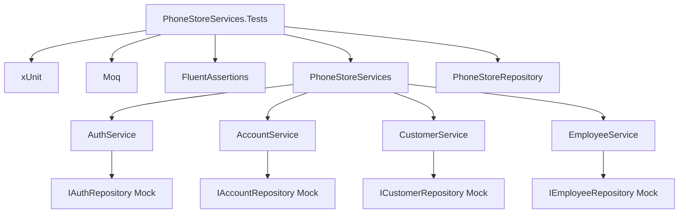

# Design Document: Unit Testing for Auth, Account, Customer, Employee Services

## Overview

Thiết kế unit test project cho các service layers của PhoneStoreAdmin. Tests sẽ sử dụng xUnit framework với Moq để mock repository dependencies, đảm bảo tests chạy độc lập không cần database.

## Architecture

```
PhoneStoreServices.Tests/
├── PhoneStoreServices.Tests.csproj
├── Services/
│   ├── AuthServiceTests.cs
│   ├── AccountServiceTests.cs
│   ├── CustomerServiceTests.cs
│   └── EmployeeServiceTests.cs
└── TestHelpers/
    └── TestDataFactory.cs
```

### Test Project Structure



## Components and Interfaces

### 1. Test Project Configuration

**PhoneStoreServices.Tests.csproj**
- Target Framework: `net8.0`
- Package References:
  - `xunit` (2.6.x)
  - `xunit.runner.visualstudio` (2.5.x)
  - `Moq` (4.20.x)
  - `FluentAssertions` (6.12.x)
  - `Microsoft.NET.Test.Sdk` (17.x)
- Project References:
  - `PhoneStoreServices`
  - `PhoneStoreRepository`

### 2. AuthServiceTests

**Dependencies to Mock:**
- `IAuthRepository`

**Test Cases:**

| Test Method | Scenario | Expected Result |
|-------------|----------|-----------------|
| `LoginAsync_ValidCredentials_ReturnsAccount` | Valid username/password | Returns Account, updates last login |
| `LoginAsync_InvalidCredentials_ReturnsNull` | Wrong password | Returns null |
| `LoginAsync_EmptyUsername_ReturnsNull` | Empty/null username | Returns null without calling repo |
| `LoginAsync_EmptyPassword_ReturnsNull` | Empty/null password | Returns null without calling repo |
| `LoginAsync_RepositoryThrows_ReturnsNull` | Repository throws exception | Returns null |
| `ValidateCredentialsAsync_ValidCredentials_ReturnsTrue` | Valid credentials | Returns true |
| `ValidateCredentialsAsync_InvalidCredentials_ReturnsFalse` | Invalid credentials | Returns false |
| `ChangePasswordAsync_ValidCurrentPassword_ReturnsAccount` | Correct current password | Returns updated Account |
| `ChangePasswordAsync_InvalidCurrentPassword_ReturnsNull` | Wrong current password | Returns null |
| `ChangePasswordAsync_EmptyNewPassword_ReturnsNull` | Empty new password | Returns null |

### 3. AccountServiceTests

**Dependencies to Mock:**
- `IAccountRepository`

**Test Cases:**

| Test Method | Scenario | Expected Result |
|-------------|----------|-----------------|
| `GetAccountByIdAsync_ValidId_ReturnsAccount` | Valid account ID | Returns Account |
| `GetAccountByIdAsync_RepositoryThrows_ReturnsNull` | Repository throws | Returns null |
| `GetAccountByUsernameAsync_ValidUsername_ReturnsAccount` | Valid username | Returns Account |
| `GetAccountByUsernameAsync_EmptyUsername_ReturnsNull` | Empty username | Returns null without calling repo |
| `AddAccountAsync_ValidAccount_ReturnsId` | Valid account | Returns created ID |
| `AddAccountAsync_RepositoryThrows_ReturnsZero` | Repository throws | Returns 0 |
| `UpdateAccountAsync_ValidAccount_ReturnsTrue` | Valid account | Returns true |
| `UpdateAccountAsync_NullAccount_ThrowsException` | Null account | Throws ArgumentNullException |
| `UpdateAccountRolesAsync_DuplicateRoles_NormalizesRoles` | Duplicate role IDs | Removes duplicates before calling repo |
| `IsAccountActiveAsync_ActiveAccount_ReturnsTrue` | Active account | Returns true |
| `IsAccountActiveAsync_InactiveAccount_ReturnsFalse` | Inactive account | Returns false |

### 4. CustomerServiceTests

**Dependencies to Mock:**
- `ICustomerRepository`

**Test Cases:**

| Test Method | Scenario | Expected Result |
|-------------|----------|-----------------|
| `GetCustomerByIdAsync_ValidId_ReturnsCustomer` | Valid customer ID | Returns Customer |
| `GetCustomerByEmailAsync_ValidEmail_ReturnsCustomer` | Valid email | Returns Customer |
| `GetCustomerByEmailAsync_EmptyEmail_ReturnsNull` | Empty email | Returns null without calling repo |
| `GetCustomerByPhoneAsync_EmptyPhone_ReturnsNull` | Empty phone | Returns null without calling repo |
| `AddCustomerAsync_ValidCustomer_SetsPersonType` | Valid customer | Sets PersonType = CUSTOMER |
| `AddCustomerAsync_NullCustomer_ReturnsNull` | Null customer | Returns null |
| `UpdateCustomerAsync_ValidCustomer_ReturnsTrue` | Valid customer | Returns true |
| `UpdateCustomerAsync_NullCustomer_ReturnsFalse` | Null customer | Returns false |
| `DeleteCustomerAsync_ValidId_ReturnsTrue` | Valid ID | Returns true |
| `GetCustomersFilteredAsync_WithSearchTerm_FiltersCorrectly` | Search term provided | Filters by name |
| `IsCustomerActiveAsync_ActiveCustomer_ReturnsTrue` | Active customer | Returns true |

### 5. EmployeeServiceTests

**Dependencies to Mock:**
- `IEmployeeRepository`

**Test Cases:**

| Test Method | Scenario | Expected Result |
|-------------|----------|-----------------|
| `GetEmployeeByIdAsync_ValidId_ReturnsEmployee` | Valid employee ID | Returns Employee |
| `GetEmployeeByEmailAsync_ValidEmail_ReturnsEmployee` | Valid email | Returns Employee |
| `GetEmployeeByEmailAsync_EmptyEmail_ReturnsNull` | Empty email | Returns null without calling repo |
| `GetEmployeeByPhoneAsync_EmptyPhone_ReturnsNull` | Empty phone | Returns null without calling repo |
| `AddEmployeeAsync_ValidEmployee_SetsPersonType` | Valid employee | Sets PersonType = EMPLOYEE |
| `AddEmployeeAsync_NullEmployee_ReturnsNull` | Null employee | Returns null |
| `UpdateEmployeeAsync_ValidEmployee_ReturnsTrue` | Valid employee | Returns true |
| `UpdateEmployeeAsync_NullEmployee_ReturnsFalse` | Null employee | Returns false |
| `GetEmployeesFiltered_WithSearchTerm_FiltersCorrectly` | Search term | Filters by FullName, Email, Phone, Code |
| `GetEmployeesFiltered_WithStatusFilter_FiltersCorrectly` | Status = "Active" | Returns only active employees |
| `GetEmployeesFiltered_WithDateRange_FiltersCorrectly` | Date range | Filters by HireDate |
| `GetEmployeesFiltered_WithPagination_ReturnsCorrectPage` | Page 2, size 10 | Returns correct page |

### 6. TestDataFactory

Helper class để tạo test data:

```csharp
public static class TestDataFactory
{
    public static Account CreateAccount(int id = 1, string username = "testuser");
    public static Customer CreateCustomer(int id = 1, string name = "Test Customer");
    public static Employee CreateEmployee(int id = 1, string name = "Test Employee");
    public static List<Employee> CreateEmployeeList(int count);
    public static List<Customer> CreateCustomerList(int count);
}
```

## Data Models

### Test Data Models (sử dụng existing models từ PhoneStoreRepository)

- `Account` - Tài khoản người dùng
- `Customer` - Khách hàng (extends Person)
- `Employee` - Nhân viên (extends Person)
- `Role` - Vai trò
- `Permission` - Quyền hạn
- `CustomerFilterCriteria` - Filter criteria cho customer
- `EmployeeFilterCriteria` - Filter criteria cho employee

## Error Handling

### Test Exception Scenarios

Mỗi service test class sẽ có tests cho các exception scenarios:

1. **Repository throws Exception** - Service phải catch và return null/false/0
2. **Null input parameters** - Service phải validate và return early
3. **Empty string parameters** - Service phải validate và return early

### Mock Setup Pattern

```csharp
// Setup mock to throw exception
_mockRepository.Setup(x => x.GetByIdAsync(It.IsAny<int>()))
    .ThrowsAsync(new Exception("Database error"));

// Verify service handles gracefully
var result = await _service.GetByIdAsync(1);
Assert.Null(result);
```

## Testing Strategy

### Test Naming Convention

```
{MethodName}_{Scenario}_{ExpectedResult}
```

Examples:
- `LoginAsync_ValidCredentials_ReturnsAccount`
- `GetCustomerByIdAsync_RepositoryThrows_ReturnsNull`
- `UpdateEmployeeAsync_NullEmployee_ReturnsFalse`

### Test Organization

```csharp
public class AuthServiceTests
{
    private readonly Mock<IAuthRepository> _mockAuthRepository;
    private readonly AuthService _authService;

    public AuthServiceTests()
    {
        _mockAuthRepository = new Mock<IAuthRepository>();
        _authService = new AuthService(_mockAuthRepository.Object);
    }

    [Fact]
    public async Task LoginAsync_ValidCredentials_ReturnsAccount()
    {
        // Arrange
        var expectedAccount = TestDataFactory.CreateAccount();
        _mockAuthRepository.Setup(x => x.AuthenticateAsync("user", "pass"))
            .ReturnsAsync(expectedAccount);
        _mockAuthRepository.Setup(x => x.UpdateLastLoginAsync(It.IsAny<int>()))
            .ReturnsAsync(true);

        // Act
        var result = await _authService.LoginAsync("user", "pass");

        // Assert
        result.Should().NotBeNull();
        result.Should().BeEquivalentTo(expectedAccount);
        _mockAuthRepository.Verify(x => x.UpdateLastLoginAsync(expectedAccount.Id), Times.Once);
    }
}
```

### Coverage Goals

- **Line Coverage**: >= 80%
- **Branch Coverage**: >= 70%
- Focus on business logic, not trivial getters/setters

### Test Execution

```bash
# Run all tests
dotnet test PhoneStoreServices.Tests

# Run with coverage
dotnet test PhoneStoreServices.Tests --collect:"XPlat Code Coverage"

# Run specific test class
dotnet test PhoneStoreServices.Tests --filter "FullyQualifiedName~AuthServiceTests"
```
