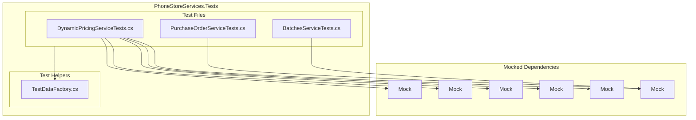
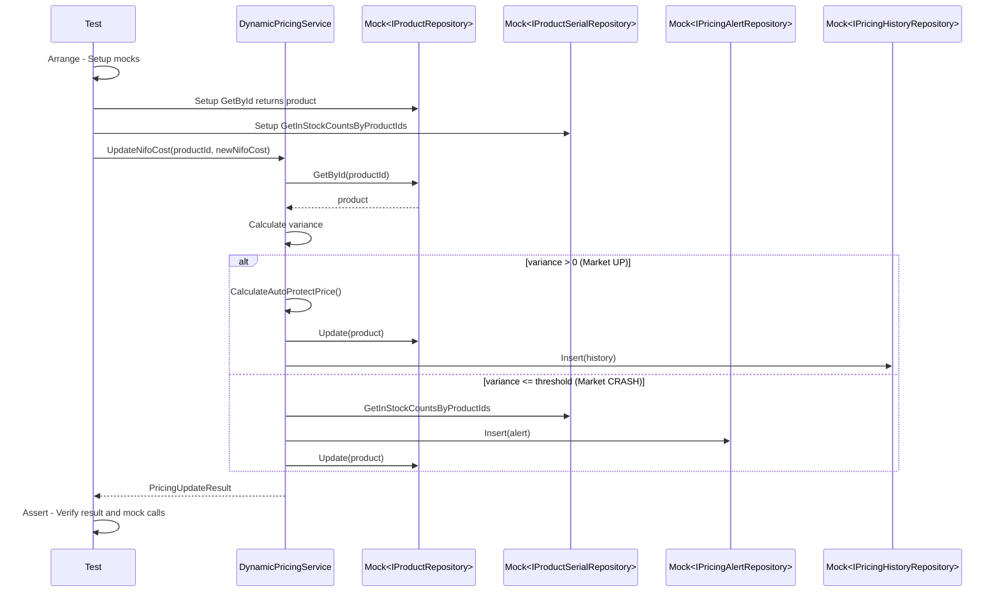

# Design Document: Unit Testing Dynamic Pricing và Import Goods

## Overview

Tài liệu này mô tả thiết kế chi tiết cho unit tests của chức năng nhập hàng và Dynamic Pricing. Tests sẽ sử dụng xUnit, Moq và FluentAssertions theo pattern đã có trong project.

### Key Design Decisions

1. **Mock all dependencies**: Sử dụng Moq để mock tất cả repositories và services
2. **Follow AAA pattern**: Arrange-Act-Assert cho mỗi test case
3. **Test isolation**: Mỗi test độc lập, không phụ thuộc vào test khác
4. **Extend TestDataFactory**: Thêm factory methods cho Product, PurchaseOrder, Batch

## Architecture



## Components and Interfaces

### 1. TestDataFactory Extensions

Thêm factory methods cho các model cần thiết:

```csharp
public static class TestDataFactory
{
    // Existing methods...
    
    /// <summary>
    /// Creates a test Product with pricing fields
    /// </summary>
    public static Product CreateProduct(
        int id = 1,
        string name = "Test Product",
        string sku = "SKU001",
        decimal price = 1000m,
        decimal costFifo = 800m,
        decimal costNifo = 850m,
        MarketTrend marketTrend = MarketTrend.STABLE,
        PricingMode pricingMode = PricingMode.AUTO_PROTECT,
        bool isSerialTracked = true)
    {
        return new Product
        {
            Id = id,
            Name = name,
            Sku = sku,
            Price = price,
            CostFifo = costFifo,
            CostNifo = costNifo,
            MarketTrend = marketTrend,
            PricingMode = pricingMode,
            IsSerialTracked = isSerialTracked,
            CreatedAt = DateTime.UtcNow
        };
    }
    
    /// <summary>
    /// Creates a test PurchaseOrder with lines
    /// </summary>
    public static PurchaseOrder CreatePurchaseOrder(
        int id = 1,
        int supplierId = 1,
        PoStatus status = PoStatus.DRAFT,
        List<PurchaseOrderLine>? lines = null)
    {
        return new PurchaseOrder
        {
            Id = id,
            SupplierId = supplierId,
            Status = status,
            CreatedAt = DateTime.UtcNow,
            PurchaseOrderLines = lines ?? new List<PurchaseOrderLine>()
        };
    }
    
    /// <summary>
    /// Creates a test PurchaseOrderLine
    /// </summary>
    public static PurchaseOrderLine CreatePurchaseOrderLine(
        int id = 1,
        int productId = 1,
        int quantity = 10,
        decimal unitCost = 800m,
        double profitMargin = 0.1)
    {
        return new PurchaseOrderLine
        {
            Id = id,
            ProductId = productId,
            Quantity = quantity,
            UnitCost = unitCost,
            ProfitMargin = profitMargin
        };
    }
    
    /// <summary>
    /// Creates a test Batch with products
    /// </summary>
    public static Batches CreateBatch(
        int id = 1,
        int purchaseOrderId = 1,
        string batchCode = "BATCH-001",
        List<BatchProduct>? products = null)
    {
        return new Batches
        {
            id = id,
            PurchaseOrderId = purchaseOrderId,
            BatchCode = batchCode,
            CreatedAt = DateTime.UtcNow,
            BatchProducts = products ?? new List<BatchProduct>()
        };
    }
    
    /// <summary>
    /// Creates a test BatchProduct
    /// </summary>
    public static BatchProduct CreateBatchProduct(
        int id = 1,
        int batchId = 1,
        int productId = 1,
        int quantity = 10,
        decimal costPrice = 800m,
        double profitMargin = 0.1)
    {
        return new BatchProduct
        {
            Id = id,
            BatchId = batchId,
            ProductId = productId,
            Quantity = quantity,
            CostPrice = costPrice,
            ProfitMargin = profitMargin,
            SellingPrice = costPrice * (1 + (decimal)profitMargin)
        };
    }
}
```

### 2. DynamicPricingServiceTests Structure

```csharp
public class DynamicPricingServiceTests
{
    private readonly Mock<IProductRepository> _mockProductRepository;
    private readonly Mock<IPricingHistoryRepository> _mockPricingHistoryRepository;
    private readonly Mock<IPricingAlertRepository> _mockPricingAlertRepository;
    private readonly Mock<ISettingStringService> _mockSettingStringService;
    private readonly Mock<IProductSerialRepository> _mockProductSerialRepository;
    private readonly DynamicPricingService _service;

    public DynamicPricingServiceTests()
    {
        _mockProductRepository = new Mock<IProductRepository>();
        _mockPricingHistoryRepository = new Mock<IPricingHistoryRepository>();
        _mockPricingAlertRepository = new Mock<IPricingAlertRepository>();
        _mockSettingStringService = new Mock<ISettingStringService>();
        _mockProductSerialRepository = new Mock<IProductSerialRepository>();
        
        // Setup default configuration
        SetupDefaultPricingConfiguration();
        
        _service = new DynamicPricingService(
            _mockProductRepository.Object,
            _mockPricingHistoryRepository.Object,
            _mockPricingAlertRepository.Object,
            _mockSettingStringService.Object,
            _mockProductSerialRepository.Object);
    }
    
    private void SetupDefaultPricingConfiguration()
    {
        _mockSettingStringService.Setup(x => x.GetValue("PRICING_DESIRED_MARGIN", It.IsAny<string>()))
            .Returns("0.10");
        _mockSettingStringService.Setup(x => x.GetValue("PRICING_MINIMUM_MARGIN", It.IsAny<string>()))
            .Returns("0.05");
        _mockSettingStringService.Setup(x => x.GetValue("PRICING_VARIANCE_THRESHOLD", It.IsAny<string>()))
            .Returns("-0.10");
        _mockSettingStringService.Setup(x => x.GetValue("PRICING_STABLE_RANGE_MAX", It.IsAny<string>()))
            .Returns("0");
        _mockSettingStringService.Setup(x => x.GetValue("PRICING_STABLE_RANGE_MIN", It.IsAny<string>()))
            .Returns("-0.05");
    }
}
```

## Test Cases Design

### UpdateFifoCost Tests

| Test Case | Input | Expected Output |
|-----------|-------|-----------------|
| NewProduct_SetsFifoEqualToNewCost | OldStock=0, NewCost=1000, Qty=10 | CostFifo=1000 |
| ExistingStock_CalculatesWeightedAverage | OldFifo=800, OldStock=10, NewCost=1000, Qty=5 | CostFifo=866.67 |
| ProductNotFound_ReturnsFalse | ProductId=999 | false |
| InvalidNewCost_ReturnsFalse | NewCost=0 | false |
| InvalidQuantity_ReturnsFalse | Quantity=0 | false |
| OldFifoZero_SetsFifoEqualToNewCost | OldFifo=0, NewCost=1000 | CostFifo=1000 |

### UpdateNifoCost Tests

| Test Case | Input | Expected Output |
|-----------|-------|-----------------|
| MarketUp_AutoProtect_IncreasesPrice | Variance=+10%, Mode=AUTO_PROTECT | Price increased |
| MarketStable_HoldsPrice | Variance=-3% | Price unchanged |
| MarketCrash_CreatesAlert | Variance=-15% | Alert created |
| NewProduct_NoCostFifo_InitializesFifo | CostFifo=0, NewNifo=1000 | CostFifo=1000 |
| NewProduct_NoPrice_InitializesPrice | Price=0, NewNifo=1000 | Price=1100 (10% margin) |
| InvalidNifoCost_ReturnsFailure | NewNifoCost=0 | Success=false |
| ClearanceMode_DoesNotIncreasePrice | Variance=+10%, Mode=CLEARANCE | Price unchanged |

### CalculateAutoProtectPrice Tests

| Test Case | Input | Expected Output |
|-----------|-------|-----------------|
| FifoGreaterThanNifo_UsesFifo | Fifo=1000, Nifo=900 | 1100 (1000 × 1.1) |
| NifoGreaterThanFifo_UsesNifo | Fifo=900, Nifo=1000 | 1100 (1000 × 1.1) |
| RoundsToTwoDecimals | Fifo=999, Nifo=900 | 1098.90 |

### CalculateClearancePrice Tests

| Test Case | Input | Expected Output |
|-----------|-------|-----------------|
| CalculatesWithMinimumMargin | Nifo=1000 | 1050 (1000 × 1.05) |
| RoundsToTwoDecimals | Nifo=999 | 1048.95 |

### CalculateVariance Tests

| Test Case | Input | Expected Output |
|-----------|-------|-----------------|
| PositiveVariance_MarketUp | Fifo=1000, Nifo=1100 | 0.10 (10%) |
| NegativeVariance_MarketDown | Fifo=1000, Nifo=900 | -0.10 (-10%) |
| ZeroVariance_Stable | Fifo=1000, Nifo=1000 | 0 |
| FifoZero_ReturnsZero | Fifo=0, Nifo=1000 | 0 |

## Sequence Diagram: UpdateNifoCost Test Flow



## Error Handling

| Scenario | Expected Behavior |
|----------|-------------------|
| Product not found | Return false/failure without exception |
| Repository throws exception | Catch, log, return false/failure |
| Invalid input (cost <= 0) | Return false/failure immediately |
| Pricing history insert fails | Log error, continue operation |

## Testing Strategy

### Unit Tests Focus

1. **DynamicPricingService**: Core pricing logic
   - UpdateFifoCost: Weighted average calculation
   - UpdateNifoCost: Market trend detection and price adjustment
   - CalculateAutoProtectPrice: MAX formula
   - CalculateClearancePrice: Minimum margin formula
   - CalculateVariance: Variance calculation

2. **Integration Points** (mock dependencies):
   - PurchaseOrderService.TriggerPricingUpdate
   - BatchesService.TriggerPricingUpdates

### Test Coverage Goals

- All public methods of DynamicPricingService
- Edge cases: zero values, negative values, boundary conditions
- Error handling paths
- Integration with PurchaseOrderService and BatchesService

