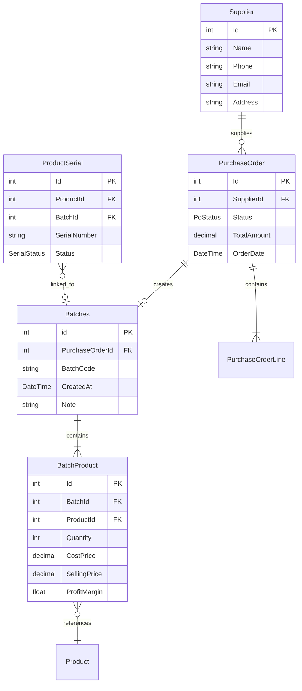
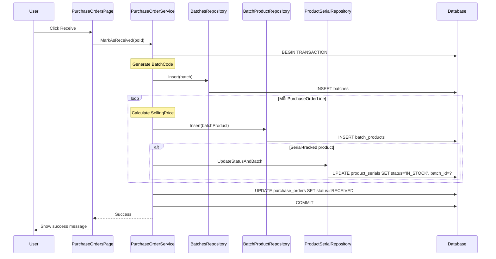
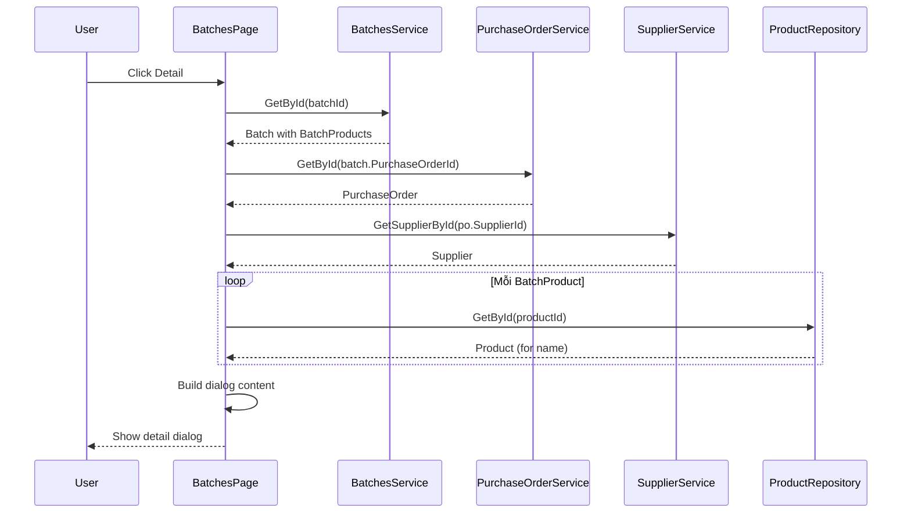

# Batch Management Flow Analysis

## Tổng quan

Tài liệu này phân tích chi tiết quy trình quản lý lô hàng (Batch Management) trong hệ thống PhoneStoreAdmin. Batch là đơn vị quản lý hàng hóa được tạo tự động khi nhận hàng từ Purchase Order, chứa thông tin về giá nhập, giá bán và số lượng sản phẩm.

## Kiến trúc hệ thống

### Các thành phần chính

| Layer | Component | File | Mô tả |
|-------|-----------|------|-------|
| Presentation | BatchesPage | `View/BatchesPage.xaml.cs` | Trang danh sách lô hàng |
| Business Logic | BatchesService | `PhoneStoreServices/Services/Implementations/BatchesService.cs` | Xử lý nghiệp vụ |
| Data Access | BatchesRepository | `PhoneStoreRepository/Repositories/` | Truy cập dữ liệu |
| Data Access | BatchProductRepository | `PhoneStoreRepository/Repositories/` | Truy cập chi tiết sản phẩm trong lô |

### Data Models

```csharp
// Batches - Lô hàng
public class Batches
{
    int id                              // Primary key
    int PurchaseOrderId                 // FK đến PurchaseOrder
    string? BatchCode                   // Mã lô hàng (BATCH-{poId}-{timestamp})
    DateTime CreatedAt                  // Ngày tạo lô
    string? Note                        // Ghi chú
    ICollection<BatchProduct> BatchProducts  // Chi tiết sản phẩm trong lô
    PurchaseOrder PurchaseOrder         // Navigation property
}

// BatchProduct - Chi tiết sản phẩm trong lô
public class BatchProduct
{
    int Id                              // Primary key
    int BatchId                         // FK đến Batches
    int ProductId                       // FK đến Product
    int Quantity                        // Số lượng
    decimal CostPrice                   // Giá nhập
    decimal SellingPrice                // Giá bán
    float ProfitMargin                  // Biên độ lợi nhuận (0.20 = 20%)
}
```

## Flowchart - Quy trình quản lý lô hàng

```mermaid
flowchart TD
    subgraph "1. Tạo lô hàng (từ PurchaseOrder)"
        A[PurchaseOrder status = DRAFT] --> B[User click Receive]
        B --> C[PurchaseOrderService.MarkAsReceived]
        C --> D[Tạo Batch mới]
        D --> E[Generate BatchCode: BATCH-{poId}-{timestamp}]
        E --> F[Loop: Mỗi PurchaseOrderLine]
        F --> G[Tính SellingPrice = UnitCost × 1 + ProfitMargin]
        G --> H[Tạo BatchProduct]
        H --> I{Còn line?}
        I -->|Yes| F
        I -->|No| J[Update ProductSerial: RESERVED → IN_STOCK]
        J --> K[Gán BatchId cho Serial]
        K --> L[Update PO status → RECEIVED]
    end

    subgraph "2. Xem danh sách lô hàng"
        M[User mở BatchesPage] --> N[LoadBatches]
        N --> O[GetBatchesFiltered với filter]
        O --> P[Hiển thị danh sách với pagination]
    end

    subgraph "3. Xem chi tiết lô hàng"
        Q[User click Detail] --> R[GetById batch]
        R --> S[Load BatchProducts]
        S --> T[Load PurchaseOrder info]
        T --> U[Load Supplier info]
        U --> V[Hiển thị dialog chi tiết]
    end

    subgraph "4. Xóa lô hàng"
        W[User click Delete] --> X[Delete BatchProducts]
        X --> Y[Delete Batch]
    end

    L --> M
```

## Chi tiết các phương thức chính

### 1. GetById - Lấy thông tin lô hàng

```csharp
public Batches? GetById(int id)
```

**Luồng xử lý:**
1. Lấy Batch từ repository
2. Load BatchProducts liên quan
3. Return batch với đầy đủ thông tin

### 2. Insert - Tạo lô hàng mới

```csharp
public void Insert(Batches batch)
```

**Luồng xử lý:**
1. Bắt đầu transaction
2. Insert Batch vào database
3. Với mỗi BatchProduct:
   - Gán BatchId
   - Insert vào database
4. Commit transaction

**Lưu ý:** Trong thực tế, Batch được tạo tự động bởi `PurchaseOrderService.MarkAsReceived()`, không phải từ UI trực tiếp.

### 3. Update - Cập nhật lô hàng

```csharp
public void Update(Batches batch)
```

**Luồng xử lý:**
1. Bắt đầu transaction
2. Update thông tin Batch (BatchCode, Note, etc.)
3. Xóa tất cả BatchProducts cũ
4. Insert BatchProducts mới
5. Commit transaction

### 4. Delete - Xóa lô hàng

```csharp
public void Delete(int id)
```

**Luồng xử lý:**
1. Bắt đầu transaction
2. Xóa tất cả BatchProducts liên quan
3. Xóa Batch
4. Commit transaction

**Cảnh báo:** Xóa batch không tự động xóa ProductSerial liên quan. Cần xử lý riêng nếu cần.

### 5. GetBatchesFiltered - Lấy danh sách với filter

```csharp
public BatchesResult GetBatchesFiltered(
    int? purchaseOrderId,
    int? supplierId,
    string? batchCode,
    DateTime? fromDate,
    DateTime? toDate,
    string? note,
    int page = 1,
    int pageSize = 10)
```

**Luồng xử lý:**
1. Gọi repository với các filter parameters
2. Tính tổng số records và pages
3. Với mỗi batch:
   - Load BatchProducts
   - Load PurchaseOrder
   - Load Supplier
4. Return BatchesResult với pagination info

## Mối quan hệ giữa các entities



## Cách tính giá bán trong BatchProduct

Khi tạo BatchProduct từ PurchaseOrderLine:

```csharp
// Trong PurchaseOrderService.MarkAsReceived()
var sellingPrice = line.UnitCost * (1 + (decimal)line.ProfitMargin);

var batchProduct = new BatchProduct
{
    BatchId = batch.id,
    ProductId = line.ProductId,
    Quantity = line.Quantity,
    CostPrice = line.UnitCost,
    SellingPrice = sellingPrice,
    ProfitMargin = line.ProfitMargin
};
```

**Công thức:**
```
SellingPrice = CostPrice × (1 + ProfitMargin)

Ví dụ:
- CostPrice = 10,000,000 VND
- ProfitMargin = 0.15 (15%)
- SellingPrice = 10,000,000 × 1.15 = 11,500,000 VND
- Profit per unit = 1,500,000 VND
```

## UI Flow - BatchesPage

### Danh sách lô hàng

| Chức năng | Method | Mô tả |
|-----------|--------|-------|
| Load danh sách | `LoadBatches()` | Lấy danh sách batch với filter và pagination |
| Tìm kiếm | `SearchBox_TextChanged()` | Tìm theo batch code |
| Lọc theo supplier | `SelectSupplierButton_Click()` | Mở dialog chọn supplier |
| Lọc theo ngày | `FilterChangeDate()` | Lọc theo date range |
| Xem chi tiết | `BtnDetail_Click()` | Hiển thị dialog chi tiết batch |
| Xóa | `BtnDelete_Click()` | Xóa batch |
| Pagination | `BtnNextPage_Click()`, `BtnLastPage_Click()` | Chuyển trang |

### Filter Options

- **Batch Code**: Tìm kiếm theo mã lô
- **Supplier**: Chọn từ danh sách
- **Date Range**: Từ ngày - Đến ngày (CreatedAt)
- **Note**: Tìm theo ghi chú

### Permission Control

```csharp
CanAddBatch = session.HasPermission("BATCH_ADD");
CanEditBatch = session.HasPermission("BATCH_EDIT");
CanDeleteBatch = session.HasPermission("BATCH_DELETE");
```

### Chi tiết lô hàng (Dialog)

Khi click "Detail", hiển thị:
- **Header**: Batch Code
- **Thông tin chung**:
  - Supplier Name
  - Batch ID
  - Purchase Order ID
  - Created At
  - PO Date
  - Note
- **Danh sách sản phẩm**:
  - Product Name
  - Quantity
  - Cost Price
  - Selling Price

## Sequence Diagram - Tạo Batch từ PO



## Sequence Diagram - Xem chi tiết Batch



## Transaction Management

Tất cả các operations quan trọng sử dụng database transactions:

```csharp
var (connection, transaction) = _dataSource.BeginTransaction();
try
{
    // Perform operations
    transaction.Commit();
}
catch (Exception ex)
{
    transaction.Rollback();
    Logger.Error("Operation failed - transaction rolled back", ex);
    throw;
}
finally
{
    transaction.Dispose();
    connection.Dispose();
}
```

## Mối quan hệ với Stock Quantity

### Serial-tracked products (IsSerialTracked = true)
- Stock được tính từ `ProductSerial` với `status = 'IN_STOCK'`
- Khi bán: Serial status chuyển từ `IN_STOCK` → `SOLD`
- BatchProduct.Quantity không thay đổi (chỉ là số lượng ban đầu)

### Non-serial-tracked products (IsSerialTracked = false)
- Stock được tính từ `BatchProduct.Quantity`
- Khi bán: `BatchProduct.Quantity` giảm tương ứng

```sql
-- Serial-tracked: Count serials
SELECT COUNT(*) FROM product_serials 
WHERE product_id = ? AND status = 'in_stock'

-- Non-serial-tracked: Sum batch quantities
SELECT SUM(quantity) FROM batch_products 
WHERE product_id = ?
```

## Kết luận

Quy trình quản lý lô hàng trong PhoneStoreAdmin có các đặc điểm:

1. **Tự động tạo**: Batch được tạo tự động khi nhận hàng từ PO
2. **Liên kết chặt chẽ**: Batch → PurchaseOrder → Supplier
3. **Pricing**: Lưu trữ CostPrice, SellingPrice, ProfitMargin cho mỗi sản phẩm
4. **Serial tracking**: ProductSerial được liên kết với Batch khi nhận hàng
5. **Transaction-safe**: Tất cả operations sử dụng database transactions

### Điểm mạnh
- Truy xuất nguồn gốc: Từ Batch → PO → Supplier
- Quản lý giá theo lô: Mỗi batch có thể có giá khác nhau
- Tích hợp với serial tracking

### Điểm cần cải thiện
- Thêm tính năng xem profit analysis cho batch
- Thêm báo cáo inventory aging theo batch
- Hỗ trợ export batch report ra PDF
- Thêm tính năng merge/split batches
