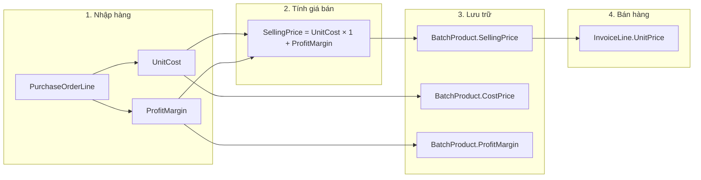
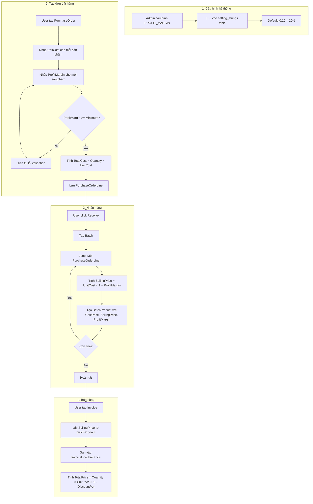
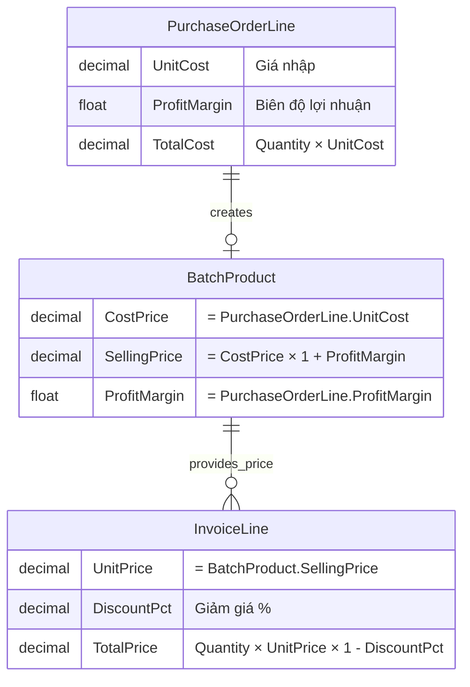
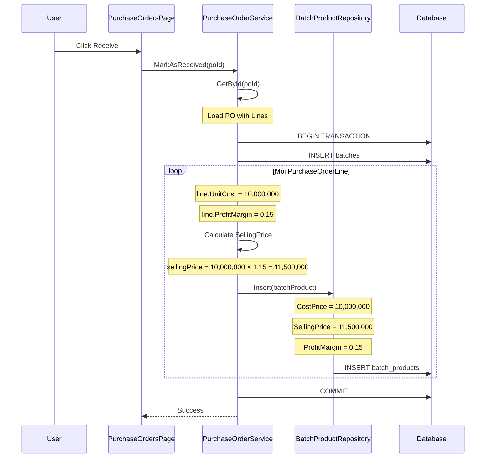

# Pricing Mechanism Analysis

## Tổng quan

Tài liệu này phân tích chi tiết cơ chế định giá (Pricing Mechanism) trong hệ thống PhoneStoreAdmin, bao gồm cách tính giá bán từ giá nhập và biên độ lợi nhuận (Profit Margin).

## Kiến trúc định giá

### Luồng dữ liệu giá



## Data Models liên quan đến giá

### PurchaseOrderLine - Giá nhập

```csharp
public class PurchaseOrderLine
{
    int Id                    // Primary key
    int PurchaseOrderId       // FK đến PurchaseOrder
    int ProductId             // FK đến Product
    int Quantity              // Số lượng
    decimal UnitCost          // Giá nhập/đơn vị (CostPrice)
    decimal TotalCost         // Tổng giá = Quantity × UnitCost
    float ProfitMargin        // Biên độ lợi nhuận (0.20 = 20%)
}
```

### BatchProduct - Giá trong lô hàng

```csharp
public class BatchProduct
{
    int Id                    // Primary key
    int BatchId               // FK đến Batches
    int ProductId             // FK đến Product
    int Quantity              // Số lượng
    decimal CostPrice         // Giá nhập (từ PurchaseOrderLine.UnitCost)
    decimal SellingPrice      // Giá bán (tính từ công thức)
    float ProfitMargin        // Biên độ lợi nhuận (từ PurchaseOrderLine)
}
```

## Công thức tính giá

### Công thức cơ bản

```
SellingPrice = CostPrice × (1 + ProfitMargin)
```

### Ví dụ tính toán

| CostPrice (VND) | ProfitMargin | SellingPrice (VND) | Profit/Unit (VND) |
|-----------------|--------------|--------------------|--------------------|
| 10,000,000 | 0.10 (10%) | 11,000,000 | 1,000,000 |
| 10,000,000 | 0.15 (15%) | 11,500,000 | 1,500,000 |
| 10,000,000 | 0.20 (20%) | 12,000,000 | 2,000,000 |
| 10,000,000 | 0.25 (25%) | 12,500,000 | 2,500,000 |
| 10,000,000 | 0.30 (30%) | 13,000,000 | 3,000,000 |

### Code Implementation

```csharp
// Trong PurchaseOrderService.MarkAsReceived()
var sellingPrice = line.UnitCost * (1 + (decimal)line.ProfitMargin);

var batchProduct = new BatchProduct
{
    BatchId = batch.id,
    ProductId = line.ProductId,
    Quantity = line.Quantity,
    CostPrice = line.UnitCost,
    SellingPrice = sellingPrice,
    ProfitMargin = line.ProfitMargin
};
```

## System Settings - Minimum Profit Margin

### Cấu hình hệ thống

Hệ thống có setting `PROFIT_MARGIN` để quy định biên độ lợi nhuận tối thiểu:

```csharp
// Trong SettingStringService
private static readonly Dictionary<SystemSettingCode, (string Value, string Type)> DefaultSettings = new()
{
    { SystemSettingCode.PROFIT_MARGIN, ("0.20", "number") },  // Default 20%
};
```

### Sử dụng trong AddPurchaseOrderPage

```csharp
private float _minimumProfitMargin = 0.2f; // Default 20%

private void LoadMinimumProfitMargin()
{
    try
    {
        var profitMarginStr = SettingStringService.GetValue(SystemSettingCode.PROFIT_MARGIN, "0.20");
        if (float.TryParse(profitMarginStr, System.Globalization.NumberStyles.Float, 
            System.Globalization.CultureInfo.InvariantCulture, out var profitMargin))
        {
            _minimumProfitMargin = profitMargin;
        }
    }
    catch (Exception ex)
    {
        _minimumProfitMargin = 0.2f; // Fallback to default
    }
}
```

### Validation khi tạo PO

```csharp
// Trong OnCreatePurchaseOrder()
var invalidProfitMarginItems = PurchaseOrderItems
    .Where(item => item.ProfitMargin < _minimumProfitMargin)
    .Select(item => $"{item.ProductName}: {item.ProfitMargin:P0} (minimum: {_minimumProfitMargin:P0})")
    .ToList();

if (invalidProfitMarginItems.Any())
{
    var errorMessage = $"Profit margin must be >= {_minimumProfitMargin:P0} (system setting):\n\n" +
        string.Join("\n", invalidProfitMarginItems);
    // Show error dialog
    return;
}
```

## Flowchart - Quy trình định giá



## Mối quan hệ giữa các entities về giá



## Các điểm lưu trữ giá trong hệ thống

| Entity | Field | Mô tả | Nguồn |
|--------|-------|-------|-------|
| PurchaseOrderLine | UnitCost | Giá nhập/đơn vị | User nhập |
| PurchaseOrderLine | ProfitMargin | Biên độ lợi nhuận | User nhập (>= minimum) |
| PurchaseOrderLine | TotalCost | Tổng giá nhập | Quantity × UnitCost |
| BatchProduct | CostPrice | Giá nhập | = PurchaseOrderLine.UnitCost |
| BatchProduct | SellingPrice | Giá bán | = CostPrice × (1 + ProfitMargin) |
| BatchProduct | ProfitMargin | Biên độ lợi nhuận | = PurchaseOrderLine.ProfitMargin |
| InvoiceLine | UnitPrice | Giá bán/đơn vị | = BatchProduct.SellingPrice |
| InvoiceLine | DiscountPct | Giảm giá % | User nhập hoặc từ Promotion |
| InvoiceLine | TotalPrice | Tổng tiền | Quantity × UnitPrice × (1 - DiscountPct) |

## Tính toán lợi nhuận

### Gross Profit per Unit

```
GrossProfit = SellingPrice - CostPrice
            = CostPrice × (1 + ProfitMargin) - CostPrice
            = CostPrice × ProfitMargin
```

### Gross Profit per Batch

```
BatchGrossProfit = Σ (SellingPrice - CostPrice) × QuantitySold
```

### Ví dụ

```
Batch có 10 sản phẩm:
- CostPrice = 10,000,000 VND
- ProfitMargin = 0.15 (15%)
- SellingPrice = 11,500,000 VND

Nếu bán hết 10 sản phẩm:
- Total Revenue = 10 × 11,500,000 = 115,000,000 VND
- Total Cost = 10 × 10,000,000 = 100,000,000 VND
- Gross Profit = 115,000,000 - 100,000,000 = 15,000,000 VND
```

## UI hiển thị giá

### AddPurchaseOrderPage

| Field | Hiển thị | Format |
|-------|----------|--------|
| UnitCost | TextBox | Currency (VND) |
| ProfitMargin | TextBox/Slider | Percentage (%) |
| Calculated SellingPrice | TextBlock (readonly) | Currency (VND) |

### BatchesPage (Detail Dialog)

| Field | Hiển thị | Format |
|-------|----------|--------|
| CostPrice | TextBlock | Currency (VND) |
| SellingPrice | TextBlock (bold) | Currency (VND) |
| ProfitMargin | TextBlock | Percentage (%) |

### SalesPage

| Field | Hiển thị | Format |
|-------|----------|--------|
| Price (SellingPrice) | TextBlock | Currency (VND) |
| StockQuantity | TextBlock | Number |

## Validation Rules

### ProfitMargin Validation

```csharp
// Rule 1: ProfitMargin phải >= 0
[Range(0, 1)]
public float ProfitMargin { get; set; }

// Rule 2: ProfitMargin phải >= MinimumProfitMargin (từ system settings)
if (item.ProfitMargin < _minimumProfitMargin)
{
    // Show error
}
```

### UnitCost Validation

```csharp
// UnitCost phải > 0
[Required]
[Range(0, double.MaxValue)]
public decimal UnitCost { get; set; }
```

## Sequence Diagram - Định giá khi nhận hàng



## Kết luận

Cơ chế định giá trong PhoneStoreAdmin có các đặc điểm:

1. **Công thức đơn giản**: SellingPrice = CostPrice × (1 + ProfitMargin)
2. **Minimum Profit Margin**: Có thể cấu hình qua system settings
3. **Lưu trữ đầy đủ**: CostPrice, SellingPrice, ProfitMargin được lưu trong BatchProduct
4. **Validation**: Kiểm tra ProfitMargin >= minimum trước khi lưu PO

### Điểm mạnh
- Công thức tính giá rõ ràng, dễ hiểu
- Có thể cấu hình minimum profit margin
- Lưu trữ đầy đủ thông tin giá để tính toán lợi nhuận

### Điểm cần cải thiện
- Thêm tính năng bulk update profit margin cho nhiều sản phẩm
- Hiển thị profit margin dạng % trong UI (hiện tại lưu dạng decimal)
- Thêm báo cáo profit analysis theo batch/product
- Hỗ trợ pricing rules phức tạp hơn (tiered pricing, volume discount)
