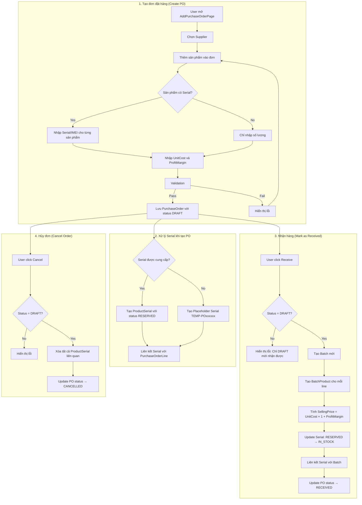
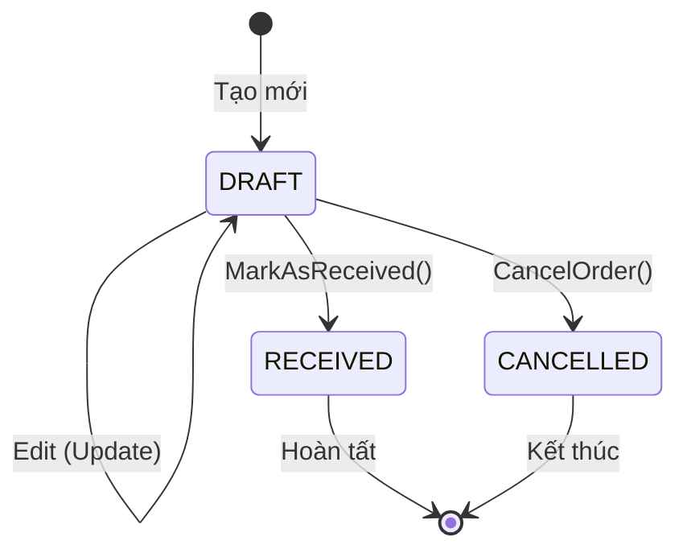
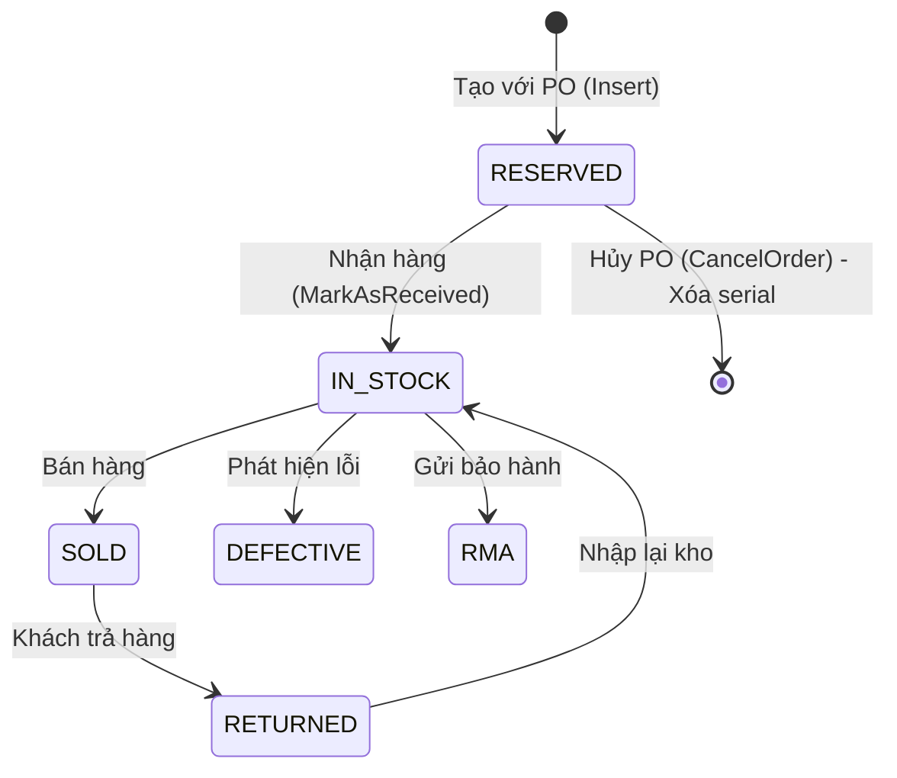
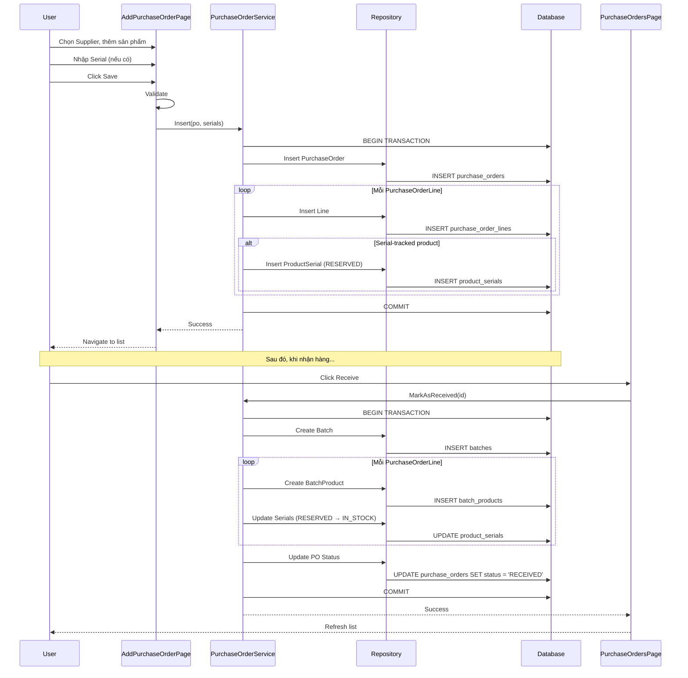

# Purchase Order Flow Analysis

## Tổng quan

Tài liệu này phân tích chi tiết quy trình nhập hàng (Purchase Order) trong hệ thống PhoneStoreAdmin, bao gồm các bước từ tạo đơn đặt hàng đến nhận hàng và quản lý serial.

## Kiến trúc hệ thống

### Các thành phần chính

| Layer | Component | File | Mô tả |
|-------|-----------|------|-------|
| Presentation | PurchaseOrdersPage | `View/PurchaseOrdersPage.xaml.cs` | Trang danh sách đơn đặt hàng |
| Presentation | AddPurchaseOrderPage | `View/AddContainers/AddPurchaseOrderPage.xaml.cs` | Trang tạo/sửa đơn đặt hàng |
| Business Logic | PurchaseOrderService | `PhoneStoreServices/Services/Implementations/PurchaseOrderService.cs` | Xử lý nghiệp vụ |
| Data Access | PurchaseOrderRepository | `PhoneStoreRepository/Repositories/` | Truy cập dữ liệu |

### Data Models

```csharp
// PurchaseOrder - Đơn đặt hàng
public class PurchaseOrder
{
    int Id                              // Primary key
    int SupplierId                      // FK đến Supplier
    int CreatedBy                       // User tạo đơn
    DateTime OrderDate                  // Ngày đặt hàng
    PoStatus Status                     // DRAFT | RECEIVED | CANCELLED
    decimal TotalAmount                 // Tổng tiền
    string? Note                        // Ghi chú
    ICollection<PurchaseOrderLine> PurchaseOrderLines  // Chi tiết đơn hàng
}

// PurchaseOrderLine - Chi tiết dòng sản phẩm
public class PurchaseOrderLine
{
    int Id                              // Primary key
    int PurchaseOrderId                 // FK đến PurchaseOrder
    int ProductId                       // FK đến Product
    int Quantity                        // Số lượng
    decimal UnitCost                    // Giá nhập/đơn vị
    decimal TotalCost                   // Tổng giá = Quantity × UnitCost
    float ProfitMargin                  // Biên độ lợi nhuận (0.20 = 20%)
}
```

## Flowchart - Quy trình nhập hàng



## Chi tiết các phương thức chính

### 1. Insert - Tạo đơn đặt hàng mới

```csharp
public void Insert(PurchaseOrder po, Dictionary<int, List<ProductSerial>>? serialsByLineId = null)
```

**Luồng xử lý:**
1. Bắt đầu transaction
2. Tính `TotalAmount = Sum(PurchaseOrderLines.TotalCost)`
3. Insert PurchaseOrder vào database
4. Với mỗi PurchaseOrderLine:
   - Insert line vào database
   - Kiểm tra `Product.IsSerialTracked`
   - Nếu có serial được cung cấp → Insert với status `RESERVED`
   - Nếu không → Tạo placeholder serial `TEMP-PO{poId}-P{productId}-{index}`
5. Commit transaction

**Validation:**
- Serial number không được trống cho sản phẩm serial-tracked
- ProfitMargin >= MinimumProfitMargin (từ system settings)

### 2. MarkAsReceived - Nhận hàng

```csharp
public void MarkAsReceived(int id)
```

**Luồng xử lý:**
1. Kiểm tra PO tồn tại và status = DRAFT
2. Tạo Batch mới với `BatchCode = BATCH-{poId}-{timestamp}`
3. Với mỗi PurchaseOrderLine:
   - Tính `SellingPrice = UnitCost × (1 + ProfitMargin)`
   - Tạo BatchProduct với CostPrice, SellingPrice, ProfitMargin
   - Update ProductSerial: `RESERVED → IN_STOCK`, gán BatchId
4. Update PO status → RECEIVED
5. Commit transaction

**Công thức tính giá bán:**
```
SellingPrice = CostPrice × (1 + ProfitMargin)

Ví dụ:
- CostPrice = 10,000,000 VND
- ProfitMargin = 0.15 (15%)
- SellingPrice = 10,000,000 × 1.15 = 11,500,000 VND
```

### 3. CancelOrder - Hủy đơn

```csharp
public void CancelOrder(int id)
```

**Luồng xử lý:**
1. Kiểm tra PO tồn tại và status ≠ CANCELLED
2. Xóa tất cả ProductSerial liên quan đến PO
3. Xóa BatchProduct và Batch (nếu có)
4. Update PO status → CANCELLED
5. Commit transaction

### 4. AddProductSerials - Thêm serial thủ công

```csharp
public void AddProductSerials(int purchaseOrderId, int purchaseOrderLineId, List<ProductSerial> serials)
```

**Luồng xử lý:**
1. Kiểm tra PO tồn tại và status = DRAFT
2. Validate serial number không trống
3. Insert từng serial với status `RESERVED`
4. Commit transaction

## State Diagram - Trạng thái PurchaseOrder



## State Diagram - Trạng thái ProductSerial



## UI Flow - PurchaseOrdersPage

### Danh sách đơn đặt hàng

| Chức năng | Method | Mô tả |
|-----------|--------|-------|
| Load danh sách | `LoadPurchaseOrders()` | Lấy danh sách PO với filter và pagination |
| Tìm kiếm | `SearchBox_TextChanged()` | Tìm theo tên supplier |
| Lọc | `FilterChange()` | Lọc theo status, date range, amount |
| Tạo mới | `BtnCreate_Click()` | Navigate đến AddPurchaseOrderPage |
| Sửa | `BtnEdit_Click()` | Navigate với PO ID (chỉ DRAFT) |
| Nhận hàng | `BtnReceive_Click()` | Gọi MarkAsReceived (chỉ DRAFT) |
| Hủy | `BtnCancel_Click()` | Gọi CancelOrder (chỉ DRAFT) |
| Xem chi tiết | `BtnDetail_Click()` | Hiển thị dialog chi tiết |

### Filter Options

- **Status**: DRAFT, RECEIVED, CANCELLED
- **Supplier**: Chọn từ danh sách
- **Date Range**: Từ ngày - Đến ngày
- **Amount Range**: Min - Max

### Permission Control

```csharp
CanAddPurchaseOrder = session.HasPermission("PURCHASE_ORDERS_ADD");
CanEditPurchaseOrder = session.HasPermission("PURCHASE_ORDERS_EDIT");
CanReceivePurchaseOrder = session.HasPermission("PURCHASE_ORDERS_MANAGE");
```

## UI Flow - AddPurchaseOrderPage

### Tạo/Sửa đơn đặt hàng

| Chức năng | Method | Mô tả |
|-----------|--------|-------|
| Chọn Supplier | `OnSelectSupplier()` | Mở dialog chọn supplier |
| Tìm sản phẩm | `OnSearchTextChanged()` | Filter sản phẩm theo tên |
| Lọc sản phẩm | `OnCategorySelectionChanged()`, `OnBrandSelectionChanged()` | Filter theo category/brand |
| Thêm sản phẩm | Click từ danh sách | Thêm vào PurchaseOrderItems |
| Nhập Serial | Trong item | Nhập serial cho sản phẩm serial-tracked |
| Lưu | `OnCreatePurchaseOrder()` | Validate và lưu PO |
| In PDF | `OnPrintPurchaseOrder()` | Xuất PDF đơn đặt hàng |
| Xóa | `OnClearPurchaseOrder()` | Xóa tất cả items |
| Hủy | `OnCancel()` | Quay lại trang danh sách |

### Validation Rules

1. **Supplier**: Bắt buộc chọn
2. **Products**: Ít nhất 1 sản phẩm
3. **Serial-tracked products**:
   - Số lượng serial = Quantity
   - Serial number không được trống
4. **Profit Margin**: >= MinimumProfitMargin (từ system settings, mặc định 20%)

## Transaction Management

Tất cả các operations quan trọng sử dụng database transactions để đảm bảo tính toàn vẹn dữ liệu:

```csharp
var (connection, transaction) = _dataSource.BeginTransaction();
try
{
    // Perform operations
    transaction.Commit();
}
catch (Exception ex)
{
    transaction.Rollback();
    Logger.Error("Operation failed - transaction rolled back", ex);
    throw;
}
finally
{
    transaction.Dispose();
    connection.Dispose();
}
```

## Error Handling

| Error | Condition | Message |
|-------|-----------|---------|
| PO_NOT_FOUND | GetById returns null | "Purchase order not found" |
| INVALID_STATUS_RECEIVE | Status ≠ DRAFT | "Only DRAFT purchase orders can be marked as received" |
| INVALID_STATUS_CANCEL | Status = CANCELLED | "Purchase order is already cancelled" |
| INVALID_STATUS_EDIT | Status ≠ DRAFT | "Only DRAFT purchase orders can be edited" |
| SERIAL_REQUIRED | Serial number empty | "Serial number is required" |
| INVALID_PROFIT_MARGIN | ProfitMargin < Minimum | "Profit margin must be >= {minimum}" |

## Sequence Diagram - Tạo và nhận đơn hàng



## Kết luận

Quy trình nhập hàng trong PhoneStoreAdmin được thiết kế với các đặc điểm:

1. **Transaction-safe**: Tất cả operations sử dụng database transactions
2. **Serial tracking**: Hỗ trợ quản lý serial/IMEI cho sản phẩm điện thoại
3. **Profit margin**: Tự động tính giá bán dựa trên giá nhập và biên độ lợi nhuận
4. **Status workflow**: DRAFT → RECEIVED/CANCELLED với validation chặt chẽ
5. **Permission-based**: Kiểm soát quyền truy cập theo role

### Điểm mạnh
- Quản lý serial từ khi tạo PO (RESERVED) đến khi nhận hàng (IN_STOCK)
- Tự động tạo Batch và BatchProduct khi nhận hàng
- Validation đầy đủ trước khi lưu

### Điểm cần cải thiện
- Thêm validation serial không trùng lặp trong hệ thống
- Hỗ trợ import serial từ file Excel/CSV
- Thêm tính năng xem lịch sử thay đổi PO
