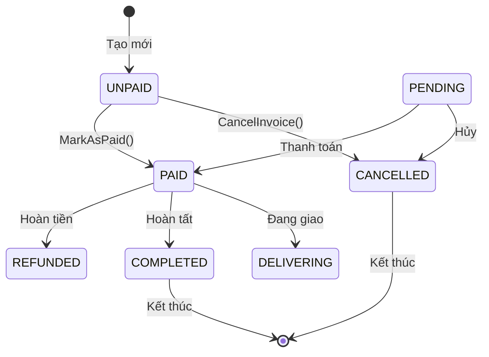
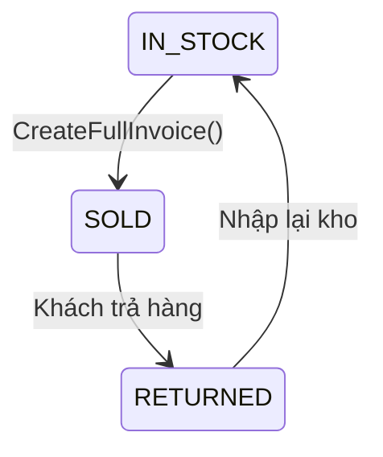
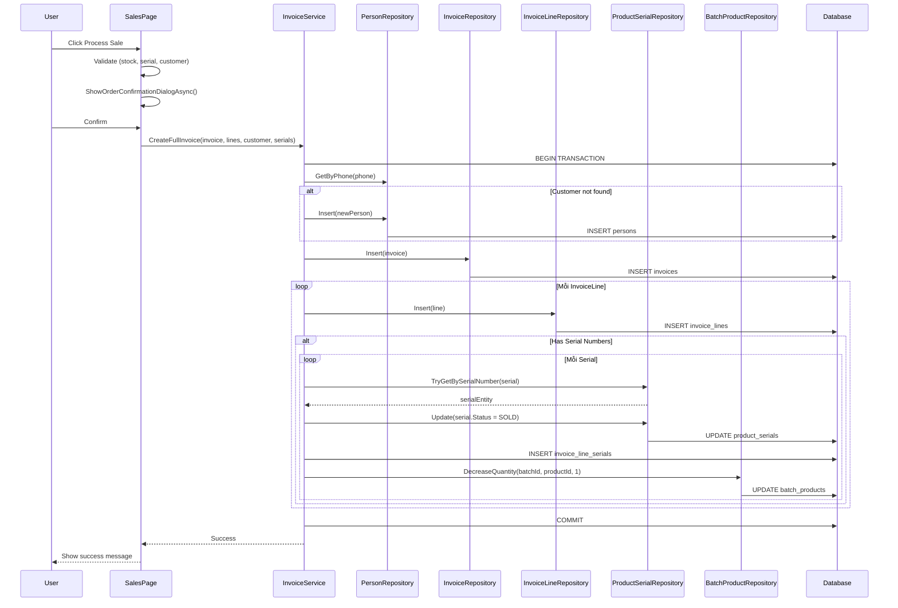
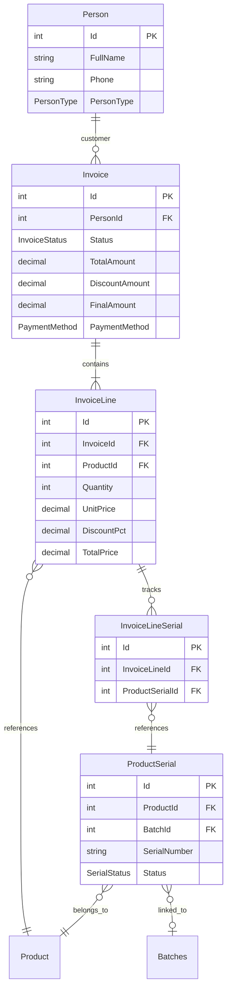

# Sales Flow Analysis

## Tổng quan

Tài liệu này phân tích chi tiết quy trình bán hàng (Sales Flow) trong hệ thống PhoneStoreAdmin, bao gồm cơ chế lấy sản phẩm, quản lý tồn kho, xử lý serial và tạo hóa đơn.

## Kiến trúc hệ thống

### Các thành phần chính

| Layer | Component | File | Mô tả |
|-------|-----------|------|-------|
| Presentation | SalesPage | `View/SalesPage.xaml.cs` | Trang POS bán hàng |
| Business Logic | InvoiceService | `PhoneStoreServices/Services/Implementations/InvoiceService.cs` | Xử lý nghiệp vụ hóa đơn |
| Data Access | InvoiceRepository | `PhoneStoreRepository/Repositories/` | Truy cập dữ liệu hóa đơn |
| Data Access | ProductSerialRepository | `PhoneStoreRepository/Repositories/` | Truy cập serial sản phẩm |
| Data Access | BatchProductRepository | `PhoneStoreRepository/Repositories/` | Truy cập số lượng batch |

### Data Models

```csharp
// Invoice - Hóa đơn
public class Invoice
{
    int Id                              // Primary key
    int? PersonId                       // FK đến Customer
    int? PromotionCodeId                // FK đến PromotionCode
    int CreatedBy                       // User tạo hóa đơn
    DateTime InvoiceDate                // Ngày tạo hóa đơn
    InvoiceStatus Status                // UNPAID | PAID | CANCELLED | ...
    decimal TotalAmount                 // Tổng tiền trước giảm giá
    decimal DiscountAmount              // Số tiền giảm giá
    decimal FinalAmount                 // Tổng tiền sau giảm giá
    PaymentMethod PaymentMethod         // CASH | CARD | TRANSFER | ...
    string? Note                        // Ghi chú
    ICollection<InvoiceLine> InvoiceLines  // Chi tiết hóa đơn
}

// InvoiceLine - Chi tiết dòng sản phẩm
public class InvoiceLine
{
    int Id                              // Primary key
    int InvoiceId                       // FK đến Invoice
    int ProductId                       // FK đến Product
    int Quantity                        // Số lượng
    decimal UnitPrice                   // Giá bán/đơn vị
    decimal DiscountPct                 // Giảm giá %
    decimal TotalPrice                  // Tổng tiền = Quantity × UnitPrice × (1 - DiscountPct)
    ICollection<InvoiceLineSerial> InvoiceLineSerials  // Serial đã bán
}

// InvoiceLineSerial - Liên kết serial với dòng hóa đơn
public class InvoiceLineSerial
{
    int Id                              // Primary key
    int InvoiceLineId                   // FK đến InvoiceLine
    int ProductSerialId                 // FK đến ProductSerial
}
```

## Flowchart - Quy trình bán hàng

```mermaid
flowchart TD
    subgraph "1. Load sản phẩm"
        A[User mở SalesPage] --> B[LoadInitialData]
        B --> C[PopulateProductsFromRepository]
        C --> D[ProductRepository.GetAll]
        D --> E{Phân loại sản phẩm}
        E -->|IsSerialTracked = true| F[Lấy stock từ ProductSerial]
        E -->|IsSerialTracked = false| G[Lấy stock từ BatchProduct]
        F --> H[GetInStockCountsByProductIds]
        G --> I[GetQuantitiesByProductIds]
        H --> J[Hiển thị danh sách sản phẩm với StockQuantity]
        I --> J
    end

    subgraph "2. Thêm sản phẩm vào giỏ"
        K[User click sản phẩm] --> L[AddProductToInvoice]
        L --> M{Stock > 0?}
        M -->|No| N[Hiển thị Out of Stock]
        M -->|Yes| O{Đã có trong giỏ?}
        O -->|Yes| P[Tăng Quantity]
        O -->|No| Q[Tạo InvoiceLineItem mới]
        Q --> R{IsSerialTracked?}
        R -->|Yes| S[InitializeSerialEntries]
        R -->|No| T[Không cần serial]
        S --> U[Cập nhật giỏ hàng]
        T --> U
        P --> U
    end

    subgraph "3. Nhập Serial (cho sản phẩm serial-tracked)"
        V[User nhập Serial] --> W[HandleSerialEntryAsync]
        W --> X{Serial hợp lệ?}
        X -->|Không tồn tại| Y[Hiển thị lỗi]
        X -->|Không khớp ProductId| Y
        X -->|Status ≠ IN_STOCK| Y
        X -->|Đã dùng trong invoice| Y
        X -->|Hợp lệ| Z[Mark serial as valid]
    end

    subgraph "4. Xử lý thanh toán"
        AA[User click Process Sale] --> AB{Có sản phẩm?}
        AB -->|No| AC[Hiển thị thông báo]
        AB -->|Yes| AD{Serial đủ cho serial-tracked?}
        AD -->|No| AE[Hiển thị lỗi thiếu serial]
        AD -->|Yes| AF{Có thông tin khách hàng?}
        AF -->|No| AG[Yêu cầu nhập thông tin]
        AF -->|Yes| AH[Hiển thị dialog xác nhận]
        AH --> AI{Xác nhận?}
        AI -->|No| AJ[Hủy]
        AI -->|Yes| AK[CreateFullInvoice]
    end

    subgraph "5. Tạo hóa đơn (Transaction)"
        AK --> AL[BEGIN TRANSACTION]
        AL --> AM{Khách hàng tồn tại?}
        AM -->|No| AN[Tạo Person mới]
        AM -->|Yes| AO[Lấy PersonId]
        AN --> AP[Insert Invoice]
        AO --> AP
        AP --> AQ[Loop: Mỗi InvoiceLine]
        AQ --> AR[Insert InvoiceLine]
        AR --> AS{Có Serial?}
        AS -->|Yes| AT[Update Serial: IN_STOCK → SOLD]
        AT --> AU[Insert InvoiceLineSerial]
        AU --> AV[DecreaseQuantity BatchProduct]
        AS -->|No| AW{Còn line?}
        AV --> AW
        AW -->|Yes| AQ
        AW -->|No| AX[COMMIT]
        AX --> AY[Hiển thị thành công]
    end

    J --> K
    U --> V
    Z --> AA
```



## Cơ chế lấy sản phẩm và số lượng tồn kho

### Phân loại sản phẩm

| Loại sản phẩm | Flag | Nguồn dữ liệu Stock | Query |
|---------------|------|---------------------|-------|
| Serial-tracked (Điện thoại) | `IsSerialTracked = true` | `product_serials` | `COUNT(*) WHERE status = 'in_stock' AND product_id = ?` |
| Non-serial-tracked (Phụ kiện) | `IsSerialTracked = false` | `batch_products` | `SUM(quantity) WHERE product_id = ?` |

### Code Implementation

```csharp
// Trong PopulateProductsFromRepository()
var serialTrackedIds = products.Where(p => p.IsSerialTracked).Select(p => p.Id).ToList();
var batchTrackedIds = products.Where(p => !p.IsSerialTracked).Select(p => p.Id).ToList();

// Lấy số lượng tồn kho
var serialStockLookup = serialTrackedIds.Count > 0
    ? _productSerialRepository.GetInStockCountsByProductIds(serialTrackedIds)
    : new Dictionary<int, int>();
    
var batchStockLookup = batchTrackedIds.Count > 0
    ? _batchProductRepository.GetQuantitiesByProductIds(batchTrackedIds)
    : new Dictionary<int, int>();

// Gán số lượng cho từng sản phẩm
var stockQty = p.IsSerialTracked
    ? (serialStockLookup.TryGetValue(p.Id, out var serialQty) ? serialQty : 0)
    : (batchStockLookup.TryGetValue(p.Id, out var batchQty) ? batchQty : 0);
```

## Chi tiết các phương thức chính

### 1. CreateFullInvoice - Tạo hóa đơn đầy đủ

```csharp
public void CreateFullInvoice(
    Invoice invoice, 
    List<InvoiceLine> uiItems, 
    string customerName, 
    string customerPhone, 
    List<InvoiceLineSerialRequest>? serialRequests = null)
```

**Luồng xử lý:**
1. Bắt đầu transaction
2. Kiểm tra khách hàng:
   - Nếu tồn tại (theo phone) → Lấy PersonId
   - Nếu không → Tạo Person mới
3. Tính toán:
   - `TotalAmount = Sum(InvoiceLine.TotalPrice)`
   - `FinalAmount = TotalAmount - DiscountAmount`
4. Insert Invoice
5. Với mỗi InvoiceLine:
   - Insert InvoiceLine
   - Nếu có serial:
     - Validate serial (status = IN_STOCK, đúng ProductId)
     - Update serial status → SOLD
     - Insert InvoiceLineSerial
     - Giảm BatchProduct.Quantity
6. Commit transaction

### 2. MarkAsPaid - Đánh dấu đã thanh toán

```csharp
public void MarkAsPaid(int id)
{
    var invoice = GetById(id);
    if (invoice != null && invoice.Status == InvoiceStatus.UNPAID)
    {
        invoice.Status = InvoiceStatus.PAID;
        _invoiceRepository.Update(invoice);
    }
}
```

### 3. CancelInvoice - Hủy hóa đơn

```csharp
public void CancelInvoice(int id)
{
    var invoice = GetById(id);
    if (invoice != null && invoice.Status != InvoiceStatus.CANCELLED)
    {
        invoice.Status = InvoiceStatus.CANCELLED;
        _invoiceRepository.Update(invoice);
    }
}
```

**Lưu ý:** Hiện tại CancelInvoice chỉ update status, không rollback serial status hoặc BatchProduct quantity.

### 4. GetTopSellingProducts - Báo cáo sản phẩm bán chạy

```csharp
public List<TopProductStatViewModel> GetTopSellingProducts(
    DateTime? fromDate,
    DateTime? toDate,
    InvoiceStatus? status,
    int topCount = 5)
```

**Luồng xử lý:**
1. Lấy danh sách Invoice theo filter
2. Aggregate InvoiceLine theo ProductId
3. Tính tổng Quantity và Revenue
4. Sắp xếp theo Revenue giảm dần
5. Lấy top N sản phẩm

## State Diagram - Trạng thái Invoice



## State Diagram - Trạng thái ProductSerial khi bán



## UI Flow - SalesPage

### Danh sách sản phẩm

| Chức năng | Method | Mô tả |
|-----------|--------|-------|
| Load sản phẩm | `PopulateProductsFromRepository()` | Lấy tất cả sản phẩm với stock |
| Tìm kiếm | `OnSearchTextChanged()` | Filter theo tên, brand |
| Lọc category | `OnCategorySelectionChanged()` | Filter theo category |
| Lọc brand | `OnBrandSelectionChanged()` | Filter theo brand |
| Refresh | `OnRefreshFilters()` | Reset tất cả filter |

### Giỏ hàng

| Chức năng | Method | Mô tả |
|-----------|--------|-------|
| Thêm sản phẩm | `AddProductToInvoice()` | Thêm vào InvoiceItems |
| Thay đổi số lượng | `ChangeInvoiceItemQuantity()` | Cập nhật quantity |
| Xóa sản phẩm | `RemoveProductFromInvoice()` | Xóa khỏi InvoiceItems |
| Nhập serial | `HandleSerialEntryAsync()` | Validate và lưu serial |
| Tính tổng | `CalculateInvoiceTotal()` | Subtotal, VAT, Total |

### Khách hàng

| Chức năng | Method | Mô tả |
|-----------|--------|-------|
| Lookup by phone | `LookupCustomerByPhoneAsync()` | Tìm khách hàng theo SĐT |
| Apply existing | `ApplyExistingCustomer()` | Gán thông tin khách hàng |
| Clear | `ClearCustomerSelection()` | Xóa thông tin khách hàng |

### Thanh toán

| Chức năng | Method | Mô tả |
|-----------|--------|-------|
| Process sale | `OnProcessSale()` | Xử lý thanh toán |
| Confirm dialog | `ShowOrderConfirmationDialogAsync()` | Hiển thị xác nhận |
| Clear invoice | `OnClearInvoice()` | Reset tất cả |

## Validation Rules

### Stock Validation

```csharp
private bool EnsureStockAvailability(int productId, int desiredQuantity, bool showAlert, out string errorMessage)
{
    var product = FindSalesItemById(productId);
    var stockQty = product?.StockQuantity ?? 0;

    if (stockQty <= 0)
    {
        errorMessage = "Out of Stock";
        return false;
    }

    if (desiredQuantity > stockQty)
    {
        errorMessage = $"Insufficient stock. Available: {stockQty}";
        return false;
    }

    return true;
}
```

### Serial Validation

```csharp
// Trong HandleSerialEntryAsync()
if (serialEntity == null)
    entry.SetValidation(false, "Serial không tồn tại.");
else if (serialEntity.ProductId != item.ProductId)
    entry.SetValidation(false, "Serial không khớp sản phẩm này.");
else if (serialEntity.Status != SerialStatus.IN_STOCK)
    entry.SetValidation(false, $"Serial không khả dụng ({serialEntity.Status}).");
else if (IsDuplicateSerialInInvoice(serialText, entry))
    entry.SetValidation(false, "Serial đã nhập ở dòng khác.");
else
    entry.SetValidation(true, string.Empty);
```

### Customer Validation

```csharp
// Trong EnsureCustomerInfo()
if (string.IsNullOrWhiteSpace(phone))
    return false; // Yêu cầu nhập SĐT

if (!IsExistingCustomer && string.IsNullOrWhiteSpace(CustomerName))
    return false; // Yêu cầu nhập tên nếu khách mới
```

## Sequence Diagram - Tạo hóa đơn



## Mối quan hệ giữa các entities



## Công thức tính toán

### Invoice Total

```
Subtotal = Σ (InvoiceLine.TotalPrice)
VatAmount = Subtotal × 0.1 (10% VAT)
Total = Subtotal + VatAmount
FinalAmount = TotalAmount - DiscountAmount
```

### InvoiceLine Total

```
TotalPrice = Quantity × UnitPrice × (1 - DiscountPct)
```

## Transaction Management

```csharp
var (connection, transaction) = _dataSource.BeginTransaction();
try
{
    // 1. Check/Create customer
    // 2. Insert Invoice
    // 3. Insert InvoiceLines
    // 4. Update ProductSerial status
    // 5. Insert InvoiceLineSerials
    // 6. Decrease BatchProduct quantities
    
    transaction.Commit();
}
catch (Exception ex)
{
    transaction.Rollback();
    Logger.Error("Failed to create invoice - transaction rolled back", ex);
    throw;
}
finally
{
    transaction.Dispose();
    connection.Dispose();
}
```

## Kết luận

Quy trình bán hàng trong PhoneStoreAdmin có các đặc điểm:

1. **Dual stock tracking**: Serial-tracked (ProductSerial) và Non-serial-tracked (BatchProduct)
2. **Real-time validation**: Kiểm tra stock, serial trước khi bán
3. **Transaction-safe**: Tất cả operations trong một transaction
4. **Customer management**: Tự động tạo khách hàng mới nếu chưa tồn tại
5. **Serial tracking**: Liên kết serial với InvoiceLine qua InvoiceLineSerial

### Điểm mạnh
- Validation đầy đủ trước khi tạo hóa đơn
- Hỗ trợ cả sản phẩm serial-tracked và non-serial-tracked
- Transaction đảm bảo tính toàn vẹn dữ liệu
- UI thân thiện với POS workflow

### Điểm cần cải thiện
- Thêm visual indicator cho low stock (< 5 items)
- Thêm tính năng quick serial lookup (scan barcode)
- Cải thiện serial selection dialog với thông tin batch
- Thêm tính năng rollback serial khi hủy hóa đơn
- Hiển thị thêm thông tin batch, ngày nhập cho mỗi serial
