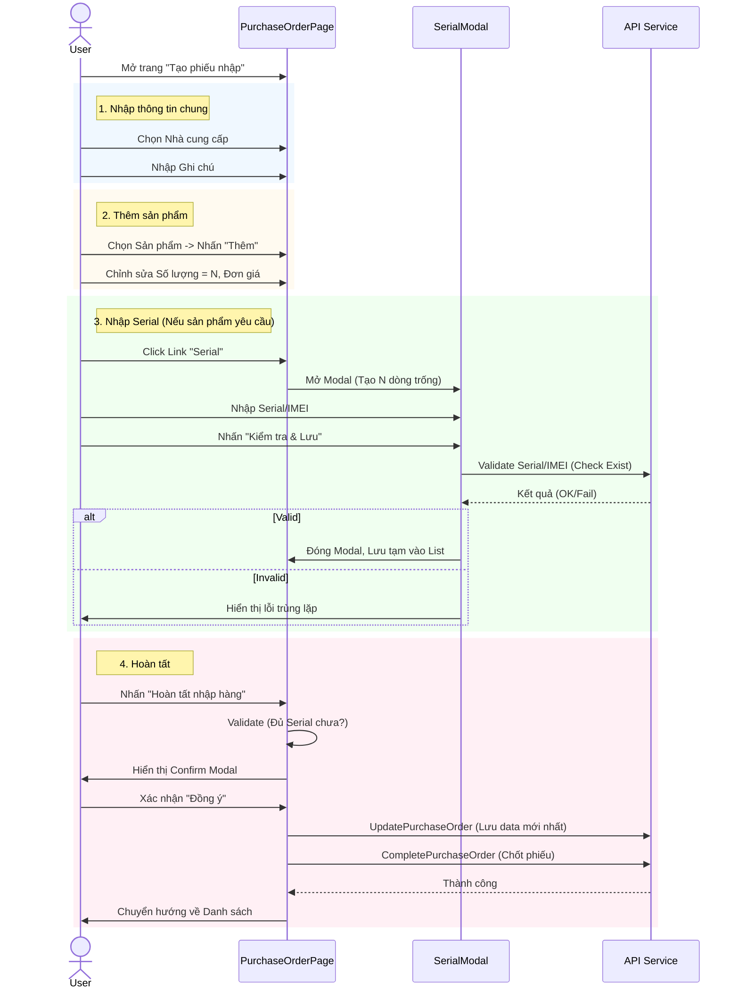
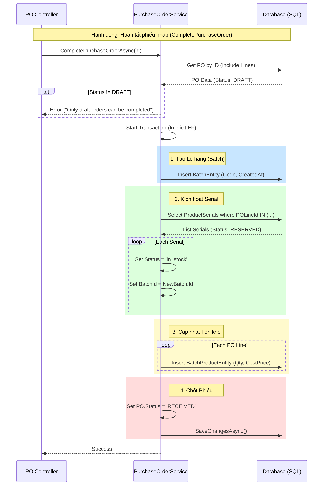

# Tài liệu Quy trình Nhập hàng (Purchase Order) - PhoneStoreUser

Tài liệu này mô tả chi tiết quy trình nhập hàng trong hệ thống `PhoneStoreUser`, bao gồm các thao tác trên giao diện người dùng (Frontend) và luồng xử lý dữ liệu dưới Backend.

## 1. Quy trình trên Giao diện (Frontend)

Người dùng (Admin/Kho) thực hiện các bước sau để tạo và hoàn tất một phiếu nhập hàng.

### Các bước thực hiện:

1.  **Truy cập trang**: Vào menu **Quản lý nhập hàng** -> Nhấn **Tạo mới** hoặc chọn một phiếu nháp để sửa.
2.  **Thông tin chung**:
    *   Chọn **Nhà cung cấp** (Bắt buộc): Nhấn nút "Chọn", tìm kiếm và chọn nhà cung cấp từ danh sách.
    *   Nhập **Ghi chú** (Tùy chọn).
3.  **Thêm sản phẩm**:
    *   Chọn sản phẩm từ danh sách thả xuống.
    *   Nhấn nút **Thêm**.
    *   Điều chỉnh **Số lượng** và **Đơn giá** trực tiếp trên bảng.
4.  **Nhập Serial/IMEI** (Đối với sản phẩm có theo dõi Serial):
    *   Nhấn vào liên kết số lượng Serial (ví dụ: `0/5 Serial`) ở cột Serial.
    *   Hệ thống hiển thị popup nhập Serial tương ứng với số lượng sản phẩm.
    *   Nhập **Serial Number** (Bắt buộc).
    *   Tùy chọn bật/tắt nhập **IMEI 1**, **IMEI 2**.
    *   Nhấn **Kiểm tra & Lưu**: Hệ thống sẽ kiểm tra trùng lặp (trên giao diện và dưới DB). Nếu hợp lệ, dữ liệu sẽ được lưu tạm vào bộ nhớ.
5.  **Lưu / Hoàn tất**:
    *   **Lưu nháp**: Nhấn nút "Lưu nháp". Dữ liệu được lưu xuống server, trạng thái là `DRAFT`.
    *   **Hoàn tất nhập hàng**:
        *   Hệ thống kiểm tra xem đã nhập đủ Serial chưa.
        *   Hiển thị hộp thoại xác nhận.
        *   Nếu đồng ý, hệ thống lưu dữ liệu lần cuối và chuyển trạng thái sang `RECEIVED`. Tồn kho được cập nhật.

### Sequence Diagram (Frontend Interactions)

---

## 2. Quy trình Xử lý dưới Backend

Phần này mô tả cách dữ liệu được xử lý, lưu trữ và luân chuyển khi người dùng gọi các API.

### Luồng dữ liệu chính:

1.  **Lưu Nháp (Create/Update)**:
    *   Mục tiêu: Lưu trạng thái làm việc hiện tại, chưa ảnh hưởng tồn kho thực tế.
    *   Dữ liệu `PurchaseOrder` và `PurchaseOrderLine` được lưu/cập nhật.
    *   Dữ liệu `ProductSerial` được lưu với trạng thái **`RESERVED`** (Đã giữ chỗ, nhưng chưa bán được).

2.  **Hoàn tất (Complete)**:
    *   Mục tiêu: Xác nhận hàng đã về kho, cộng số lượng tồn kho, cho phép bán.
    *   **Tạo Lô (Batch)**: Tạo một bản ghi `BatchEntity` để quản lý đợt nhập hàng này.
    *   **Cập nhật Serial**: Chuyển trạng thái `ProductSerial` từ `RESERVED` sang **`in_stock`**. Gán `BatchId` cho các Serial này.
    *   **Tạo Tồn kho (BatchProduct)**: Tạo các bản ghi vào bảng `BatchProduct` (Đây là bảng quản lý số lượng tồn kho thực tế theo lô và giá vốn).
    *   **Cập nhật Trạng thái Phiếu**: Đổi Status của PO sang **`RECEIVED`**.

### Sequence Diagram (Backend Processing)

### Chi tiết thay đổi Model

*   **ProductSerialEntity**:
    *   Khi tạo PO (Draft): Status = `RESERVED`
    *   Khi hoàn tất PO: Status = `in_stock`, `BatchId` được cập nhật.
*   **BatchProductEntity**:
    *   Được tạo mới hoàn toàn khi hoàn tất PO. Đây là nguồn dữ liệu để tính "Số lượng tồn" hiện tại của sản phẩm.
